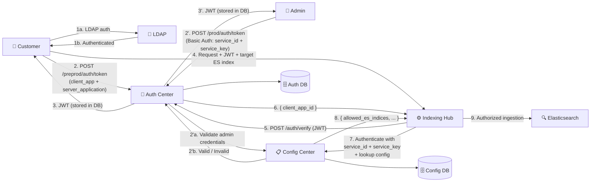
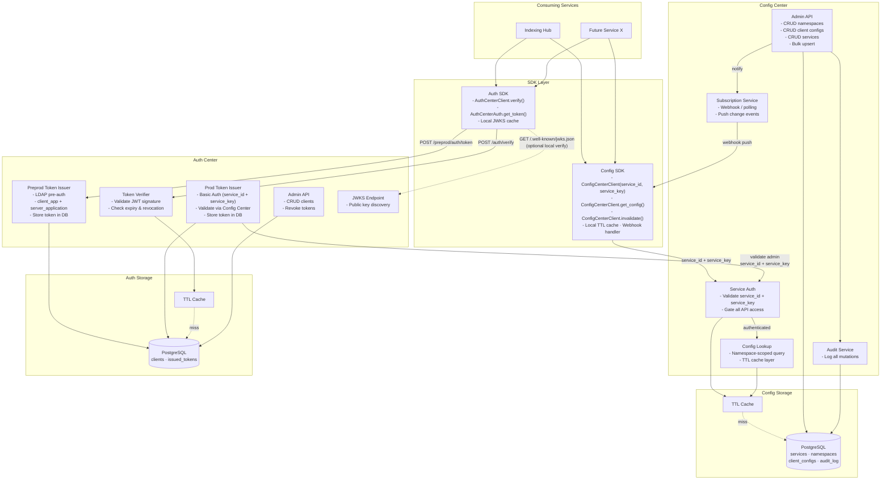
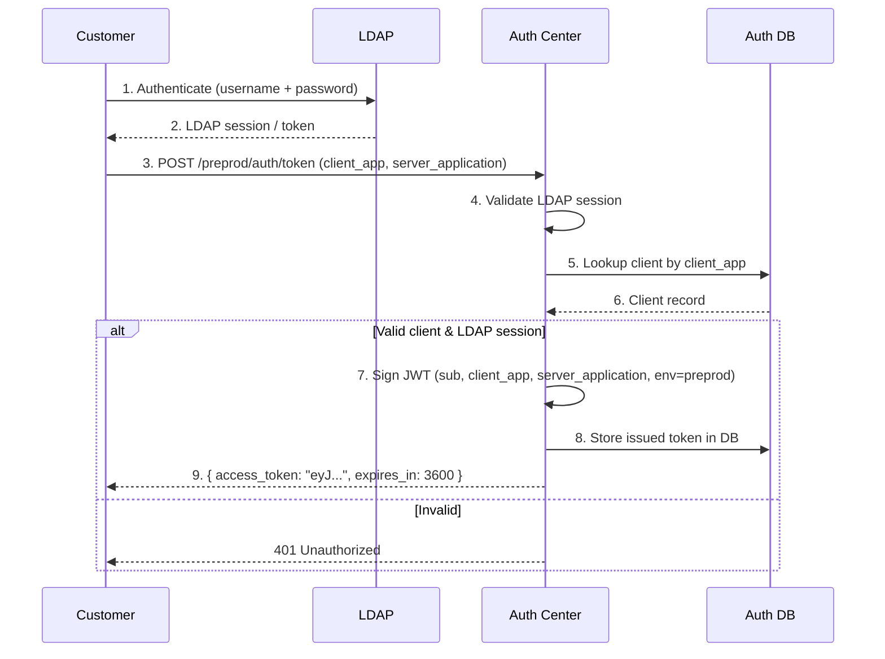
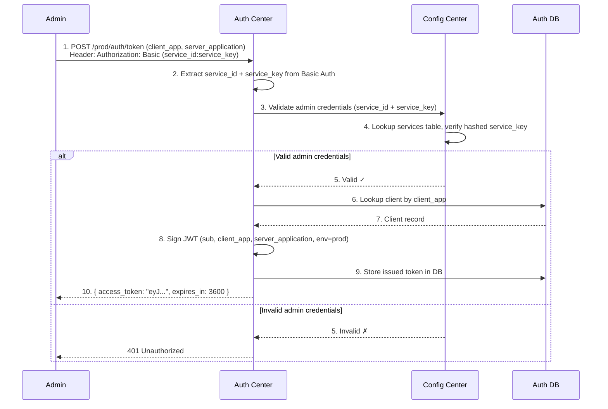
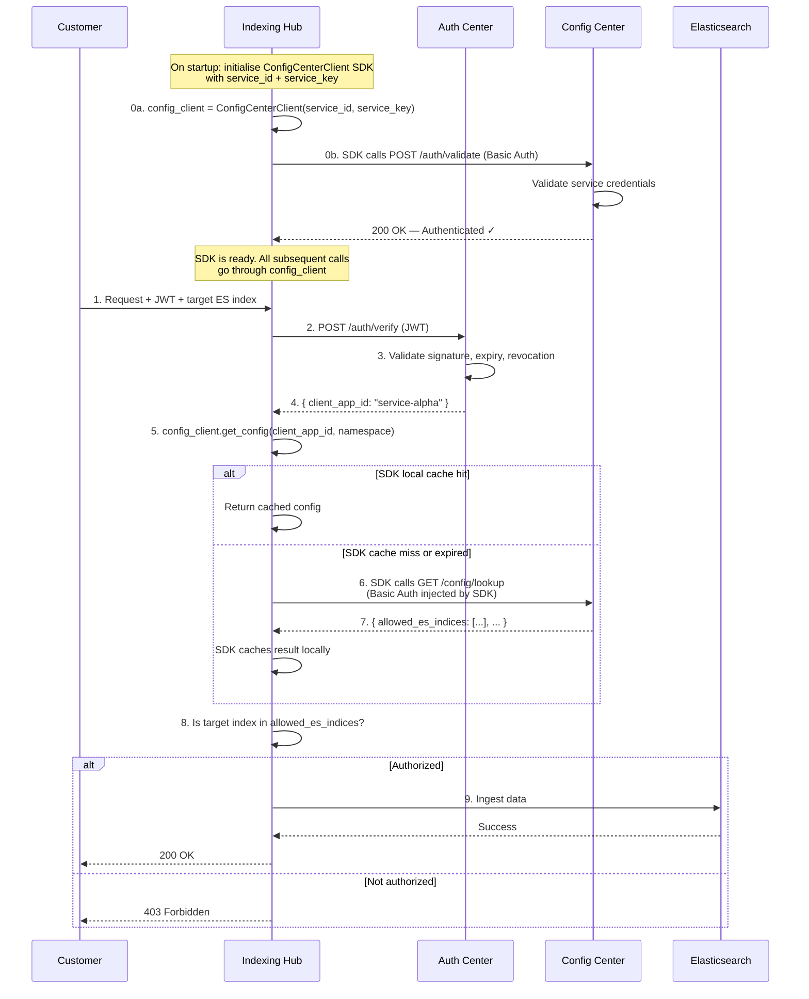
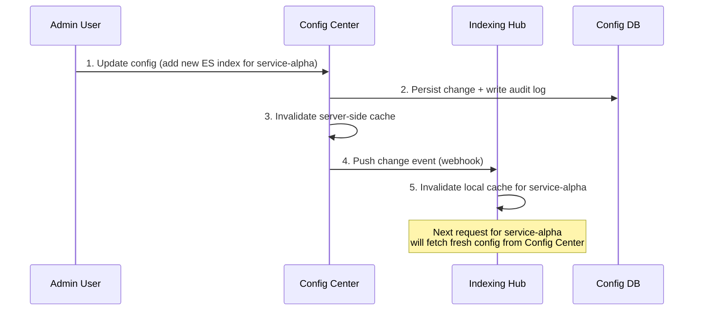
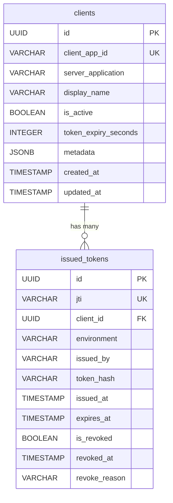
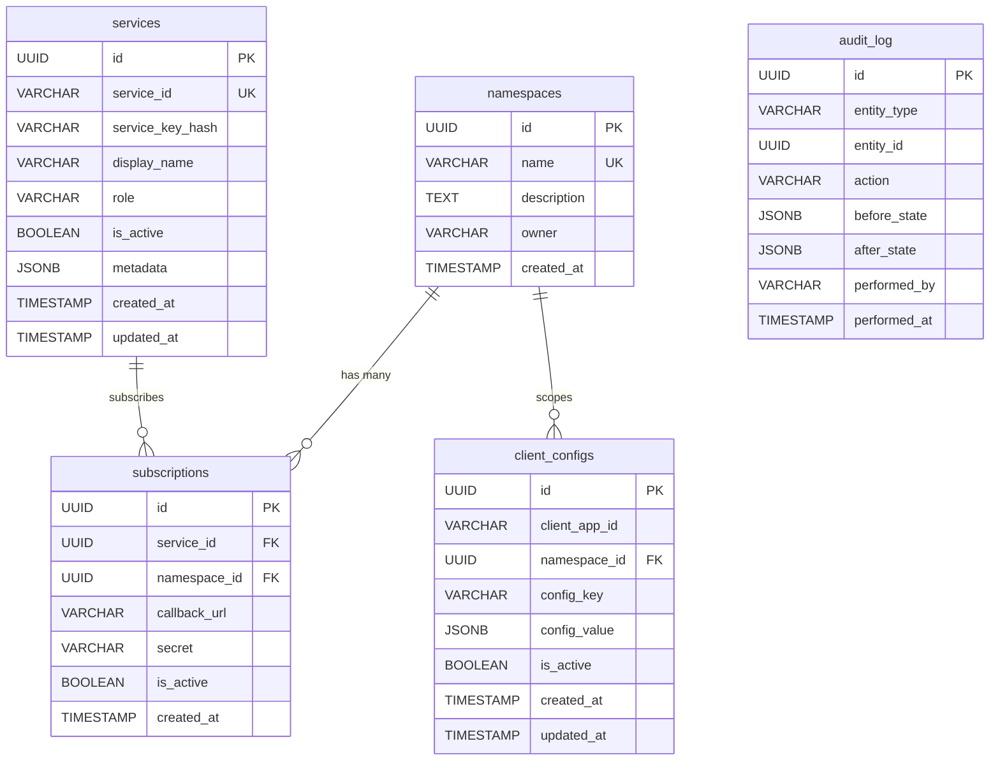

# Design Document: Auth Center & Config Center

**Date:** 23 March 2026
**Status:** Draft
**Version:** 3.1

---

## 1. Executive Summary

The Indexing Hub currently relies on a third-party external auth provider for token generation and hardcoded mappings between client applications and their dedicated Elasticsearch indices. Both are problematic: the external auth cannot be extended with custom metadata, and the hardcoded mappings require code changes and redeployments for every customer onboarding or configuration change.

This document proposes two **separate, centralized services** to replace the current setup:

1. **Auth Center** — A standalone authentication service that fully replaces the external auth provider. It registers clients, manages credentials, issues identity-only JWTs, and verifies tokens. Its single responsibility is answering: *"Is this client who they claim to be?"*

2. **Config Center** — A standalone configuration service that stores namespace-scoped key-value configuration for any consuming service. Consuming services (like the Indexing Hub) **subscribe** to the Config Center to retrieve their client-specific config (e.g. allowed ES indices) and can update config via its Admin API. Its single responsibility is answering: *"What is this client allowed/configured to do in my service?"*

By separating auth from config, each service has a clear, single responsibility, can scale independently, and can be adopted by future services without coupling.

---

## 2. Problem Statement

### 2.1 Current Workflow (Indexing Hub)

1. Customer authenticates with the external auth provider to obtain a token.
2. Customer sends the token and the target ES index name to the Indexing Hub.
3. Indexing Hub verifies the token and extracts the client application identity.
4. Indexing Hub looks up a **hardcoded mapping** to determine the allowed ES index for that client.
5. If the requested ES index does not match, an authentication error is returned.
6. If it matches, the ingestion request is processed.

### 2.2 Pain Points

**External auth is a black box:** The external auth provider is third-party and cannot be modified. We have no control over token structure, expiry policies, claims, or revocation. This forces every consuming service to maintain its own supplementary mapping logic.

**Hardcoded values are not scalable:** Every customer onboarding or config change requires a code change, review, and redeployment. At worst, each service ends up building its own ad-hoc config API — duplicating effort across teams.

**No single source of truth:** If multiple services need to know "what is client X allowed to do?", each service maintains its own copy. This leads to drift, inconsistency, and operational risk.

**Auth and config are entangled:** The current Indexing Hub mixes authentication (is this token valid?) with authorization/config (which index can this client use?) in the same code path. This makes both harder to maintain and impossible to reuse.

**Dependency on a third party for a critical path:** Authentication is on the critical path of every request. Depending on a third-party provider introduces availability risk, vendor lock-in, and limits customization.

---

## 3. Proposed Solution: Two Separate Services

### 3.1 Auth Center

A **standalone authentication microservice** that owns the full client auth lifecycle:

- **LDAP pre-authentication** — customers must first authenticate via LDAP before requesting a token.
- **Dual-environment token issuance:**
  - **Preprod** (`/preprod/auth/token`) — customers self-service. After LDAP auth, customer passes `client_app` + `server_application` to generate a token.
  - **Prod** (`/prod/auth/token`) — admin-only. Admin authenticates via Basic Auth (`service_id` + `service_key`), which the Auth Center validates against the **Config Center's services table**. Admin then generates a production token on behalf of the client.
- **Token persistence** — all issued tokens are stored in the database for audit, revocation, and lifecycle management.
- **Token verification** — validate JWT signature, expiry, and revocation status.
- **Token revocation** — immediately invalidate compromised tokens.

The Auth Center does **not** know or care about what the client is allowed to do — that's the Config Center's job. However, for **production token issuance**, it depends on the Config Center to validate admin credentials.

### 3.2 Config Center

A **standalone configuration microservice** that owns namespace-scoped client configuration and **service authentication**:

- **Service registration** — each consuming service (e.g. Indexing Hub) and admin is registered with a `service_id` + `service_key`. This is how they authenticate to the Config Center.
- **Namespace registration** — each consuming service registers a namespace (e.g. `indexing-hub`).
- **Config CRUD** — store key-value pairs (JSONB) scoped to a client + namespace.
- **Config lookup** — consuming services authenticate with `service_id` + `service_key`, then query config for a given client and namespace.
- **Subscription model** — consuming services can subscribe (poll or webhook) to config changes so they maintain a local cache that stays in sync.
- **Admin credential validation** — the Auth Center calls the Config Center to validate admin `service_id` + `service_key` during production token issuance.

### 3.3 How They Work Together

The two services are complementary with a specific cross-dependency for production auth:

1. **Auth Center** owns client authentication and token lifecycle.
2. **Config Center** owns service authentication (`service_id` + `service_key`), namespace-scoped configuration, and serves as the credential store for admin/service access.
3. For **production token issuance**, the Auth Center calls the Config Center to validate the admin's `service_id` + `service_key`.
4. For **request authorization**, consuming services authenticate to the Config Center using their own `service_id` + `service_key` to fetch client config.

They share `client_app_id` as the common key linking a client's identity to their configuration.

### 3.4 Token Design

Tokens are **identity-only JWTs** signed by the Auth Center:

```json
{
  "sub": "service-alpha",
  "iss": "auth-center",
  "env": "preprod",
  "client_app": "my-app",
  "server_application": "indexing-hub",
  "iat": 1711152000,
  "exp": 1711155600,
  "jti": "unique-token-id"
}
```

Tokens include the environment (`preprod` or `prod`), the `client_app`, and the `server_application` they were issued for. No config is embedded — config is always fetched from the Config Center, so changes take effect immediately without requiring a token refresh.

### 3.5 Design Principles

- **Separation of concerns:** Auth Center owns identity and tokens; Config Center owns service credentials and configuration.
- **Environment isolation:** Preprod and prod have separate token issuance flows with different access controls.
- **Service-agnostic:** The Config Center uses namespaces — no service-specific code anywhere.
- **Zero-code onboarding:** Adding a client or config entry is an API call, never a code change.
- **Single source of truth:** Auth Center owns tokens; Config Center owns service credentials and configuration.
- **Performance-first:** Both services use caching. Consuming services maintain a local config cache via subscription.
- **Fail-closed:** If either service is unreachable, consuming services deny the request.

---

## 4. Architecture Overview

### 4.1 System Context Diagram



### 4.2 Internal Component Diagram



### 4.3 Token Issuance Flow — Preprod (Customer Self-Service)



### 4.4 Token Issuance Flow — Prod (Admin Only)



### 4.5 Request Authorization Flow



### 4.6 Config Subscription Flow



---

## 5. Data Model

### Auth Center Database

#### 5.1 clients

| Column | Type | Nullable | Description |
|--------|------|----------|-------------|
| id | UUID (PK) | No | Internal unique identifier. |
| client_app_id | VARCHAR(255), UNIQUE | No | The client application identifier. Used as `sub` in JWTs. |
| server_application | VARCHAR(255) | No | The server/service this client is associated with (e.g. `indexing-hub`). |
| display_name | VARCHAR(255) | Yes | Human-readable name. |
| is_active | BOOLEAN | No | Global kill switch. Inactive clients cannot authenticate. |
| token_expiry_seconds | INTEGER | No | Per-client JWT expiry. Default: 3600. |
| metadata | JSONB | Yes | Freeform metadata (contact email, team, notes). |
| created_at | TIMESTAMP | No | Record creation timestamp. |
| updated_at | TIMESTAMP | No | Last modification timestamp. |

#### 5.2 issued_tokens

All issued tokens are persisted for audit, lifecycle management, and revocation.

| Column | Type | Nullable | Description |
|--------|------|----------|-------------|
| id | UUID (PK) | No | Internal unique identifier. |
| jti | VARCHAR(255), UNIQUE | No | The JWT ID claim. Used as the lookup key for revocation. |
| client_id | UUID (FK → clients.id) | No | The client this token was issued for. |
| environment | VARCHAR(16) | No | `preprod` or `prod`. |
| issued_by | VARCHAR(255) | No | Who issued the token — LDAP username (preprod) or admin service_id (prod). |
| token_hash | VARCHAR(512) | No | SHA-256 hash of the JWT (never store the raw token). |
| issued_at | TIMESTAMP | No | When the token was issued. |
| expires_at | TIMESTAMP | No | When the token expires. |
| is_revoked | BOOLEAN | No | Whether this token has been revoked. Default: false. |
| revoked_at | TIMESTAMP | Yes | When the token was revoked (if applicable). |
| revoke_reason | VARCHAR(255) | Yes | Why the token was revoked. |

**Design note:** By storing tokens in a single table with `is_revoked`, we combine issuance and revocation tracking. The separate `revoked_tokens` table from the previous design is no longer needed — revocation is a flag on the issued token record.

#### Auth Center ER Diagram



---

### Config Center Database

#### 5.4 services

The authentication table for consuming services and admins. Every caller of the Config Center API must authenticate with a `service_id` + `service_key`. The Auth Center also validates admin credentials against this table during production token issuance.

| Column | Type | Nullable | Description |
|--------|------|----------|-------------|
| id | UUID (PK) | No | Internal unique identifier. |
| service_id | VARCHAR(255), UNIQUE | No | Public identifier for the service (e.g. `indexing-hub`, `admin-platform`). |
| service_key_hash | VARCHAR(512) | No | Bcrypt/Argon2 hash of the service key. Never stored in plaintext. |
| display_name | VARCHAR(255) | Yes | Human-readable name. |
| role | VARCHAR(32) | No | `service` or `admin`. Admins can generate prod tokens via Auth Center. |
| is_active | BOOLEAN | No | Active flag. Inactive services are denied access. |
| metadata | JSONB | Yes | Freeform metadata (team, contact, notes). |
| created_at | TIMESTAMP | No | Record creation timestamp. |
| updated_at | TIMESTAMP | No | Last modification timestamp. |

**Design note:** The `role` field distinguishes between regular consuming services (which can only look up config) and admin services (which can also generate production tokens via the Auth Center). The service key is returned **once** at creation and never again.

#### 5.5 namespaces

| Column | Type | Nullable | Description |
|--------|------|----------|-------------|
| id | UUID (PK) | No | Internal unique identifier. |
| name | VARCHAR(128), UNIQUE | No | Namespace key (e.g. `indexing-hub`). |
| description | TEXT | Yes | What this namespace is used for. |
| owner | VARCHAR(255) | Yes | Team or person responsible. |
| created_at | TIMESTAMP | No | Record creation timestamp. |

#### 5.6 client_configs

| Column | Type | Nullable | Description |
|--------|------|----------|-------------|
| id | UUID (PK) | No | Internal unique identifier. |
| client_app_id | VARCHAR(255) | No | The client this config belongs to. Matches `client_app_id` in Auth Center. |
| namespace_id | UUID (FK → namespaces.id) | No | The namespace this config belongs to. |
| config_key | VARCHAR(255) | No | The configuration key (e.g. `allowed_es_indices`). |
| config_value | JSONB | No | The configuration value. JSONB allows scalars, arrays, and objects. |
| is_active | BOOLEAN | No | Per-entry active flag. |
| created_at | TIMESTAMP | No | Record creation timestamp. |
| updated_at | TIMESTAMP | No | Last modification timestamp. |

**Constraints:** UNIQUE on `(client_app_id, namespace_id, config_key)`.

**Note:** The Config Center references `client_app_id` as a plain string, not a foreign key to the Auth Center's database. The two services have separate databases. The `client_app_id` is the shared contract between them.

#### 5.7 subscriptions

Tracks which consuming services subscribe to config change notifications.

| Column | Type | Nullable | Description |
|--------|------|----------|-------------|
| id | UUID (PK) | No | Internal unique identifier. |
| namespace_id | UUID (FK → namespaces.id) | No | The namespace being subscribed to. |
| callback_url | VARCHAR(512) | No | Webhook URL to notify on config changes. |
| secret | VARCHAR(255) | No | Shared secret for signing webhook payloads (HMAC). |
| is_active | BOOLEAN | No | Active flag. |
| created_at | TIMESTAMP | No | Record creation timestamp. |

#### 5.8 audit_log

| Column | Type | Nullable | Description |
|--------|------|----------|-------------|
| id | UUID (PK) | No | Unique identifier. |
| entity_type | VARCHAR(64) | No | `namespace`, `client_config`, or `subscription`. |
| entity_id | UUID | No | ID of the affected record. |
| action | VARCHAR(32) | No | `CREATE`, `UPDATE`, `DELETE`. |
| before_state | JSONB | Yes | Snapshot before. |
| after_state | JSONB | Yes | Snapshot after. |
| performed_by | VARCHAR(255) | No | Admin who made the change. |
| performed_at | TIMESTAMP | No | When the change happened. |

#### Config Center ER Diagram



---

## 6. API Design

### 6.1 Auth Center API

#### Preprod — Customer-Facing (LDAP pre-auth required)

| Method | Endpoint | Description |
|--------|----------|-------------|
| POST | `/api/v1/preprod/auth/token` | Customer generates a preprod token. Requires valid LDAP session. Body: `client_app` + `server_application`. Token stored in DB. |
| GET | `/api/v1/.well-known/jwks.json` | Public key(s) for local JWT verification by consuming services. |

#### Prod — Admin-Only (Basic Auth: service_id + service_key)

| Method | Endpoint | Description |
|--------|----------|-------------|
| POST | `/api/v1/prod/auth/token` | Admin generates a prod token. Requires Basic Auth header (`service_id:service_key`), validated against Config Center's services table. Body: `client_app` + `server_application`. Token stored in DB. |

#### Service-Facing

| Method | Endpoint | Description |
|--------|----------|-------------|
| POST | `/api/v1/auth/verify` | Verify a JWT. Returns `client_app_id`, `server_application`, `environment` if valid. |
| POST | `/api/v1/auth/revoke` | Revoke a token by its `jti`. |

#### Admin API

| Method | Endpoint | Description |
|--------|----------|-------------|
| GET | `/api/v1/admin/clients` | List clients. Filter by `?search=`, `?is_active=`, `?server_application=`. |
| GET | `/api/v1/admin/clients/{id}` | Get a single client. |
| POST | `/api/v1/admin/clients` | Register a new client (client_app_id + server_application). |
| PUT | `/api/v1/admin/clients/{id}` | Update client (toggle active, change expiry). |
| DELETE | `/api/v1/admin/clients/{id}` | Deactivate client + revoke all active tokens. |
| GET | `/api/v1/admin/tokens` | List issued tokens. Filter by `?client_app_id=`, `?environment=`, `?is_revoked=`. |

#### Sample: POST /api/v1/preprod/auth/token

```json
// Request (LDAP session must be active)
{
  "client_app": "my-app",
  "server_application": "indexing-hub"
}

// Response (200 OK)
{
  "access_token": "eyJhbGciOiJSUzI1NiIs...",
  "token_type": "Bearer",
  "expires_in": 3600,
  "environment": "preprod"
}
```

#### Sample: POST /api/v1/prod/auth/token

```http
POST /api/v1/prod/auth/token
Authorization: Basic base64(service_id:service_key)
Content-Type: application/json

{
  "client_app": "my-app",
  "server_application": "indexing-hub"
}
```

```json
// Response (200 OK)
{
  "access_token": "eyJhbGciOiJSUzI1NiIs...",
  "token_type": "Bearer",
  "expires_in": 3600,
  "environment": "prod"
}

// Response (401) — invalid admin credentials
{
  "error": "invalid_credentials",
  "message": "Admin service_id or service_key is invalid."
}
```

#### Sample: POST /api/v1/auth/verify

```json
// Request
{
  "token": "eyJhbGciOiJSUzI1NiIs..."
}

// Response (200 OK)
{
  "client_app_id": "my-app",
  "server_application": "indexing-hub",
  "environment": "preprod",
  "is_active": true
}

// Response (401) — invalid, expired, or revoked
{
  "error": "invalid_token",
  "message": "Token signature invalid or token has expired."
}
```

---

### 6.2 Config Center API

**All Config Center endpoints require authentication via `service_id` + `service_key`** (passed as Basic Auth header or via SDK initialization).

#### Service-Facing

| Method | Endpoint | Description |
|--------|----------|-------------|
| POST | `/api/v1/auth/validate` | Validate a `service_id` + `service_key`. Used by the Auth Center to validate admin credentials for prod token issuance. |
| GET | `/api/v1/config/lookup` | Lookup config. Params: `client_app_id`, `namespace`. Returns all active key-value pairs. |
| POST | `/api/v1/config/subscribe` | Subscribe to change notifications for a namespace. |
| DELETE | `/api/v1/config/subscribe/{id}` | Unsubscribe. |

#### Admin API — Services

| Method | Endpoint | Description |
|--------|----------|-------------|
| GET | `/api/v1/admin/services` | List all registered services. Filter by `?role=`, `?is_active=`. |
| GET | `/api/v1/admin/services/{id}` | Get a single service by ID. |
| POST | `/api/v1/admin/services` | Register a new service or admin. Returns `service_key` **once**. Body: `service_id`, `display_name`, `role` (`service` or `admin`). |
| PUT | `/api/v1/admin/services/{id}` | Update service metadata (display_name, is_active, metadata). |
| DELETE | `/api/v1/admin/services/{id}` | Deactivate a service. Revokes its access. |
| POST | `/api/v1/admin/services/{id}/rotate-key` | Rotate the service key. Returns new `service_key` **once**. Old key is invalidated. |

#### Admin API — Namespaces & Configs

| Method | Endpoint | Description |
|--------|----------|-------------|
| GET | `/api/v1/admin/namespaces` | List all namespaces. |
| POST | `/api/v1/admin/namespaces` | Register a new namespace. |
| PUT | `/api/v1/admin/namespaces/{id}` | Update namespace metadata. |
| GET | `/api/v1/admin/configs` | List configs. Filter by `?client_app_id=`, `?namespace=`. |
| POST | `/api/v1/admin/configs` | Add a config entry. |
| PUT | `/api/v1/admin/configs/{id}` | Update a config entry. |
| DELETE | `/api/v1/admin/configs/{id}` | Soft-delete a config entry. |
| POST | `/api/v1/admin/configs/bulk` | Bulk upsert configs (batch onboarding). |

#### Sample: GET /api/v1/config/lookup?client_app_id=service-alpha&namespace=indexing-hub

```json
// Response (200 OK)
{
  "client_app_id": "service-alpha",
  "namespace": "indexing-hub",
  "config": {
    "allowed_es_indices": ["alpha-prod-index", "alpha-staging-index"],
    "rate_limit_per_minute": 1000,
    "max_batch_size": 500
  }
}
```

#### Sample: Webhook Payload (pushed to subscribers on config change)

```json
{
  "event": "config.updated",
  "namespace": "indexing-hub",
  "client_app_id": "service-alpha",
  "changed_keys": ["allowed_es_indices"],
  "timestamp": "2026-03-23T10:00:00Z",
  "signature": "sha256=abc123..."
}
```

The consuming service receives this webhook, invalidates its local cache for `service-alpha`, and fetches fresh config on the next request.

#### Sample: POST /api/v1/admin/services

```json
// Request
{
  "service_id": "indexing-hub",
  "display_name": "Indexing Hub",
  "role": "service",
  "metadata": { "team": "platform", "contact": "platform@company.com" }
}

// Response (201 Created) — service_key returned ONCE
{
  "id": "uuid-...",
  "service_id": "indexing-hub",
  "service_key": "sk_svc_a1b2c3d4e5f6...",
  "display_name": "Indexing Hub",
  "role": "service",
  "is_active": true,
  "message": "Store the service_key securely. It will not be shown again."
}
```

#### Sample: POST /api/v1/auth/validate

```http
POST /api/v1/auth/validate
Authorization: Basic base64(service_id:service_key)
```

```json
// Response (200 OK)
{
  "service_id": "admin-platform",
  "role": "admin",
  "is_active": true
}

// Response (401) — invalid or inactive
{
  "error": "invalid_credentials",
  "message": "Invalid service_id or service_key."
}
```

---

## 7. How the Indexing Hub Integrates (First Consumer)

### 7.1 Setup

```json
// 1. Register the Indexing Hub as a service in Config Center
POST config-center/api/v1/admin/services
{ "service_id": "indexing-hub", "display_name": "Indexing Hub", "role": "service" }
// → { "service_key": "sk_svc_..." }  (returned once — store securely)

// 2. Register an admin user in Config Center (for prod token issuance)
POST config-center/api/v1/admin/services
{ "service_id": "admin-platform", "display_name": "Admin Platform", "role": "admin" }
// → { "service_key": "sk_adm_..." }  (returned once — store securely)

// 3. Register client in Auth Center
POST auth-center/api/v1/admin/clients
{ "client_app_id": "service-alpha", "display_name": "Service Alpha",
  "server_application": "indexing-hub", "is_active": true }

// 4. Register namespace in Config Center
POST config-center/api/v1/admin/namespaces
{ "name": "indexing-hub", "owner": "platform-team" }

// 5. Add config in Config Center (authenticated with service_id + service_key)
POST config-center/api/v1/admin/configs
Authorization: Basic base64(indexing-hub:sk_svc_...)
{ "client_app_id": "service-alpha", "namespace": "indexing-hub",
  "config_key": "allowed_es_indices",
  "config_value": ["alpha-prod-index", "alpha-staging-index"] }

// 6. Indexing Hub subscribes to config changes
POST config-center/api/v1/config/subscribe
Authorization: Basic base64(indexing-hub:sk_svc_...)
{ "namespace": "indexing-hub",
  "callback_url": "https://indexing-hub.internal/webhooks/config-change",
  "secret": "whsec_..." }
```

### 7.2 Updated Indexing Hub Workflow

1. **Startup:** Indexing Hub initializes a `ConfigCenterClient` with its `service_id` + `service_key`. The client validates credentials with Config Center (`POST /auth/validate`). On success, the Indexing Hub is ready to serve.
2. **Customer token (preprod):** Customer authenticates via LDAP, then calls Auth Center (`POST /preprod/auth/token`) with `client_app` + `server_application` to get a JWT.
3. **Admin token (prod):** Admin calls Auth Center (`POST /prod/auth/token`) with Basic Auth (`service_id:service_key`). Auth Center validates against Config Center, then issues a prod JWT.
4. Customer sends the JWT + target ES index to the **Indexing Hub**.
5. Indexing Hub verifies the JWT with the **Auth Center** (`POST /auth/verify`) → gets `client_app_id`, `server_application`, `environment`.
6. Indexing Hub checks its **local config cache** for `service-alpha` in namespace `indexing-hub`.
7. On cache miss, Indexing Hub fetches config from the **Config Center** (`GET /config/lookup`, authenticated with its `service_id` + `service_key`).
8. Indexing Hub checks if the requested ES index is in `allowed_es_indices`.
9. If yes → ingest. If no → 403.

Config stays in sync because the Indexing Hub subscribes to the Config Center's webhooks. When an admin updates a mapping, the Indexing Hub's cache is invalidated automatically.

### 7.3 Indexing Hub Code Change

```python
# BEFORE (external auth + hardcoded mappings)
ALLOWED_INDICES = {
    "service-alpha": ["alpha-prod-index"],
    "service-beta": ["beta-prod-index"],
}

def verify_index_access(client_app_id, requested_index):
    allowed = ALLOWED_INDICES.get(client_app_id, [])
    if requested_index not in allowed:
        raise HTTPException(403, "Not authorized")

# AFTER (Auth Center + Config Center with service_id/service_key auth)
from sdk import AuthCenterClient, ConfigCenterClient

# Initialize at startup — Config Center validates credentials
auth_client = AuthCenterClient(base_url="https://auth-center.internal")
config_client = ConfigCenterClient(
    base_url="https://config-center.internal",
    service_id="indexing-hub",
    service_key="sk_svc_...",
)

async def verify_index_access(token, requested_index):
    # Step 1: Verify identity via Auth Center
    identity = await auth_client.verify(token)
    client_app_id = identity["client_app_id"]

    # Step 2: Get config via Config Center (authenticated, with local cache)
    config = await config_client.get_config(client_app_id, namespace="indexing-hub")
    allowed = config.get("allowed_es_indices", [])

    if requested_index not in allowed:
        raise HTTPException(403, "Not authorized")
```

### 7.4 Indexing Hub Can Update Config

The Indexing Hub (or its operators) can update ES index mappings directly via the Config Center's Admin API — no redeployment needed:

```json
PUT config-center/api/v1/admin/configs/{config_id}
{
  "config_value": ["alpha-prod-index", "alpha-staging-index", "alpha-analytics-index"]
}
```

The webhook notifies the Indexing Hub, its cache refreshes, and the client can immediately ingest to the new index.

---

## 8. How Future Services Integrate

The pattern is the same every time — no changes to either Auth Center or Config Center:

**Step 1 — Register your service in Config Center:**

```json
POST config-center/api/v1/admin/services
{ "service_id": "notification-hub", "display_name": "Notification Hub", "role": "service" }
// → { "service_key": "sk_svc_..." }  (store securely)
```

**Step 2 — Register a namespace in Config Center:**

```json
POST config-center/api/v1/admin/namespaces
Authorization: Basic base64(notification-hub:sk_svc_...)
{ "name": "notification-hub", "owner": "comms-team" }
```

**Step 3 — Add client configs under your namespace:**

```json
POST config-center/api/v1/admin/configs
Authorization: Basic base64(notification-hub:sk_svc_...)
{ "client_app_id": "service-alpha", "namespace": "notification-hub",
  "config_key": "allowed_channels", "config_value": ["email", "sms"] }
```

**Step 4 — Subscribe to config changes:**

```json
POST config-center/api/v1/config/subscribe
Authorization: Basic base64(notification-hub:sk_svc_...)
{ "namespace": "notification-hub",
  "callback_url": "https://notif-hub.internal/webhooks/config" }
```

**Step 5 — Initialize your SDK clients and integrate:**

```python
auth_client = AuthCenterClient(base_url="https://auth-center.internal")
config_client = ConfigCenterClient(
    base_url="https://config-center.internal",
    service_id="notification-hub",
    service_key="sk_svc_...",
)
```

Verify JWTs with the Auth Center, fetch config from the Config Center (authenticated with `service_id` + `service_key`). Customers use the same LDAP + Auth Center flow — no new onboarding if they're already registered as clients.

---

## 9. Caching Strategy

### 9.1 Auth Center Caching

- **Revocation list:** Cached in-memory (TTLCache) or Redis. Checked on every `/auth/verify` call.
- **Client records:** Cached for credential validation. TTL: 5 minutes.
- **Public keys (JWKS):** Consuming services that verify JWTs locally should cache the public key with a long TTL (1 hour+) and refresh when verification fails.

### 9.2 Config Center Caching

**Server-side (Config Center):** TTLCache or Redis for database query results. TTL: 5 minutes. Service credential validation results can be cached briefly (30 seconds) to reduce DB load from frequent `/auth/validate` calls.

**Client-side (Consuming services):** Each consuming service authenticates once with `service_id` + `service_key` (via the SDK's `validate()` call on startup) and then maintains a local config cache. This is the primary performance optimization — most requests are served entirely from the local cache, with no network call to the Config Center.

Cache invalidation flow:

1. Admin updates config via Config Center Admin API.
2. Config Center writes to DB, invalidates its own cache, and fires a webhook to subscribers.
3. The consuming service receives the webhook and invalidates the specific `client_app_id` in its local cache.
4. The next request for that client triggers a fresh fetch from the Config Center.

### 9.3 Failure Modes

- **Auth Center unreachable:** Consuming services deny the request (fail-closed). Optionally, services that verify JWTs locally using the JWKS endpoint can continue to authenticate clients even if the Auth Center is down — but cannot check revocation.
- **Config Center unreachable:** If the local cache has a valid entry, the consuming service can serve from cache (fail-open with stale data). If no cache entry exists, deny the request.

---

## 10. Tech Stack

| Component | Technology | Rationale |
|-----------|-----------|-----------|
| Auth Center framework | Python / FastAPI | Async, high performance, matches existing stack. |
| Config Center framework | Python / FastAPI | Same stack for consistency. |
| Auth database | PostgreSQL | Reliable, proven for auth workloads. |
| Config database | PostgreSQL | JSONB support for flexible config values. |
| LDAP integration | ldap3 (Python) | LDAP pre-authentication for preprod token issuance. |
| JWT signing | PyJWT + cryptography | RS256/ES256. Key management via cryptography lib. |
| Secret hashing | passlib (bcrypt/argon2) | Industry standard for credential and service_key hashing. |
| Caching | cachetools.TTLCache | In-process. Upgrade to Redis for multi-instance. |
| ORM / Migrations | SQLAlchemy + Alembic | Mature async support. |
| Containerization | Docker | Separate images for each service. |

---

## 11. Sample Project Structures

### Auth Center

```
auth-center/
├── app/
│   ├── main.py
│   ├── api/v1/
│   │   ├── preprod_auth.py       # /preprod/auth/token (LDAP + token issuance)
│   │   ├── prod_auth.py          # /prod/auth/token (Basic Auth admin flow)
│   │   ├── auth.py               # /auth/verify, /auth/revoke
│   │   ├── jwks.py               # /.well-known/jwks.json
│   │   └── admin/
│   │       ├── clients.py        # Client CRUD
│   │       └── tokens.py         # Token listing, revocation
│   ├── models/
│   │   ├── client.py
│   │   └── issued_token.py       # Issued + revocation tracking
│   ├── services/
│   │   ├── ldap_service.py       # LDAP pre-authentication
│   │   ├── preprod_issuer.py     # Preprod token issuance (LDAP-gated)
│   │   ├── prod_issuer.py        # Prod token issuance (admin-gated)
│   │   ├── config_center_client.py  # HTTP client to validate admin creds
│   │   └── token_service.py      # JWT sign, verify, revoke
│   ├── crypto/
│   │   └── keys.py               # RSA/EC key pair management
│   ├── cache/
│   │   └── ttl_cache.py
│   └── db/
│       ├── session.py
│       └── migrations/
├── tests/
├── Dockerfile
└── docker-compose.yml
```

### Config Center

```
config-center/
├── app/
│   ├── main.py
│   ├── api/v1/
│   │   ├── service_auth.py       # /auth/validate (service_id + service_key)
│   │   ├── config.py             # /config/lookup, /config/subscribe
│   │   └── admin/
│   │       ├── services.py       # Services CRUD + key rotation
│   │       ├── namespaces.py
│   │       └── configs.py
│   ├── models/
│   │   ├── service.py            # service_id, service_key_hash, role
│   │   ├── namespace.py
│   │   ├── client_config.py
│   │   ├── subscription.py
│   │   └── audit_log.py
│   ├── services/
│   │   ├── service_auth_service.py  # Validate service_id + service_key
│   │   ├── config_service.py     # Lookup + cache
│   │   ├── subscription_service.py  # Webhook dispatch
│   │   └── audit_service.py
│   ├── middleware/
│   │   └── basic_auth.py         # Extract & validate Basic Auth on all requests
│   ├── cache/
│   │   └── ttl_cache.py
│   └── db/
│       ├── session.py
│       └── migrations/
├── tests/
├── Dockerfile
└── docker-compose.yml
```

---

## 12. SDK / Client Libraries

### For Consuming Services

```python
# Auth Center client — used by consuming services to verify JWTs
class AuthCenterClient:
    def __init__(self, base_url: str, timeout: int = 5):
        self._base_url = base_url
        self._http = httpx.AsyncClient(timeout=timeout)

    async def verify(self, token: str) -> dict:
        """Verify JWT. Returns { client_app_id, server_application, environment, is_active }."""
        resp = await self._http.post(
            f"{self._base_url}/api/v1/auth/verify",
            json={"token": token},
        )
        resp.raise_for_status()
        return resp.json()


# Config Center client — authenticated with service_id + service_key
class ConfigCenterClient:
    def __init__(
        self,
        base_url: str,
        service_id: str,
        service_key: str,
        timeout: int = 5,
        cache_ttl: int = 300,
    ):
        self._base_url = base_url
        self._service_id = service_id
        self._service_key = service_key
        self._http = httpx.AsyncClient(
            timeout=timeout,
            auth=(service_id, service_key),  # Basic Auth on every request
        )
        self._cache = TTLCache(maxsize=1024, ttl=cache_ttl)

    async def validate(self) -> dict:
        """Validate credentials on startup. Raises on failure."""
        resp = await self._http.post(f"{self._base_url}/api/v1/auth/validate")
        resp.raise_for_status()
        return resp.json()

    async def get_config(self, client_app_id: str, namespace: str) -> dict:
        """Get config for a client in a namespace. Cached locally."""
        cache_key = f"{client_app_id}:{namespace}"
        if cache_key in self._cache:
            return self._cache[cache_key]

        resp = await self._http.get(
            f"{self._base_url}/api/v1/config/lookup",
            params={"client_app_id": client_app_id, "namespace": namespace},
        )
        resp.raise_for_status()
        result = resp.json()["config"]
        self._cache[cache_key] = result
        return result

    def invalidate(self, client_app_id: str, namespace: str):
        """Called by webhook handler to invalidate cached config."""
        self._cache.pop(f"{client_app_id}:{namespace}", None)
```

### For Customers (Preprod Token — LDAP Flow)

```python
class AuthCenterPreprodAuth:
    """Customer-facing SDK for obtaining preprod tokens via LDAP."""

    def __init__(self, base_url: str, ldap_username: str, ldap_password: str):
        self._base_url = base_url
        self._ldap_username = ldap_username
        self._ldap_password = ldap_password
        self._token = None
        self._expires_at = 0

    async def get_token(self, client_app: str, server_application: str) -> str:
        """Authenticate via LDAP and get a preprod token."""
        if self._token and time.time() < self._expires_at - 60:
            return self._token

        resp = await httpx.AsyncClient().post(
            f"{self._base_url}/api/v1/preprod/auth/token",
            json={
                "ldap_username": self._ldap_username,
                "ldap_password": self._ldap_password,
                "client_app": client_app,
                "server_application": server_application,
            },
        )
        resp.raise_for_status()
        data = resp.json()
        self._token = data["access_token"]
        self._expires_at = time.time() + data["expires_in"]
        return self._token
```

### For Admins (Prod Token — Basic Auth Flow)

```python
class AuthCenterProdAuth:
    """Admin SDK for generating production tokens via service_id + service_key."""

    def __init__(self, base_url: str, service_id: str, service_key: str):
        self._base_url = base_url
        self._http = httpx.AsyncClient(auth=(service_id, service_key))

    async def generate_prod_token(self, client_app: str, server_application: str) -> dict:
        """Generate a production token for a client (admin only)."""
        resp = await self._http.post(
            f"{self._base_url}/api/v1/prod/auth/token",
            json={
                "client_app": client_app,
                "server_application": server_application,
            },
        )
        resp.raise_for_status()
        return resp.json()
```

---

## 13. Security Considerations

### Auth Center

**JWT signing keys:** RS256 or ES256. Private key for signing only; public key distributed via JWKS endpoint. Store keys securely (secrets manager). Rotate periodically.

**LDAP integration:** LDAP credentials are validated in real-time during preprod token issuance and are **never stored** in the Auth Center. Use LDAPS (LDAP over TLS) to protect credentials in transit. Implement connection pooling with timeouts to prevent LDAP server overload. Bind with a dedicated service account for lookups; customer credentials are used only for authentication binding.

**Dual-environment isolation:** Preprod and prod token issuance use completely different authentication paths (LDAP vs. Basic Auth). Tokens include an `env` claim (`preprod` or `prod`) so consuming services can enforce environment-level access policies if needed.

**Admin credential validation:** For prod token issuance, the Auth Center delegates credential validation to the Config Center (`POST /auth/validate`). This call must happen over internal TLS. If the Config Center is unreachable, prod token issuance fails (fail-closed).

**Token persistence:** All issued tokens are stored in the `issued_tokens` table with a hash of the token (not the raw JWT). This enables revocation by `jti` and full audit of token lifecycle.

**Rate limiting:** Both `/preprod/auth/token` and `/prod/auth/token` must be rate-limited with exponential backoff on failed attempts to prevent brute-force attacks. Rate-limit separately by LDAP username (preprod) and service_id (prod).

**Token revocation:** Deactivating a client revokes all active tokens immediately. The `is_revoked` flag in `issued_tokens` is checked on every `/auth/verify` call.

### Config Center

**Service authentication:** All API endpoints are gated by `service_id` + `service_key` (Basic Auth). Service keys are hashed with bcrypt/Argon2 before storage. Plaintext is returned **once** at creation and never again. Key rotation is supported via the `/admin/services/{id}/rotate-key` endpoint.

**Role-based access:** The `services.role` field (`service` vs `admin`) controls what operations are allowed. Only `admin` role services can generate production tokens via the Auth Center. Consider expanding to finer-grained RBAC in future iterations.

**Webhook security:** Payloads signed with HMAC-SHA256 (shared secret per subscription). Consuming services must verify the `signature` header before trusting the payload. Secrets should be rotated periodically.

**Audit trail:** Every mutation logged with the authenticated `service_id` and timestamp. Before/after state snapshots enable forensic investigation.

**Input validation:** Config keys and values validated. ES index names checked against allowlist patterns. JSONB config values validated against optional schema if defined.

### Network

**Auth Center:** `/preprod/auth/token` is customer-facing (may be public, behind LDAP). `/prod/auth/token`, `/auth/verify`, and Admin API should be internal-only.

**Config Center:** All endpoints should be internal-only. No customer-facing exposure. The Auth Center → Config Center validation call (`/auth/validate`) must use mutual TLS or be restricted to internal network.

---

## 14. Monitoring & Alerting

### Auth Center Metrics

- `auth.preprod.token.issued` — preprod tokens issued (by client_app_id)
- `auth.preprod.token.failed` — failed LDAP auth attempts (by username)
- `auth.prod.token.issued` — prod tokens issued (by admin service_id, client_app_id)
- `auth.prod.token.failed` — failed admin auth attempts (by service_id)
- `auth.ldap.latency_ms` — LDAP authentication latency (p50, p95, p99)
- `auth.ldap.errors` — LDAP connection failures or timeouts
- `auth.verify.count` — verify calls (by result: success/expired/revoked, by environment)
- `auth.verify.latency_ms` — p50, p95, p99
- `auth.revoke.count` — token revocations (by environment)
- `auth.config_center.validate.latency_ms` — latency of admin credential validation via Config Center
- `auth.config_center.validate.errors` — Config Center unreachable during admin validation

### Config Center Metrics

- `config.auth.validate.count` — service credential validations (by service_id, by result)
- `config.auth.validate.failed` — failed service authentication attempts
- `config.lookup.count` — lookup calls (by namespace, by service_id)
- `config.cache.hit_rate` — server-side cache hit ratio (target: >90%)
- `config.webhook.dispatched` — webhooks sent (by namespace)
- `config.webhook.failed` — webhook delivery failures (needs retry/alerting)
- `admin.services.count` — registered services (gauge, by role)
- `admin.mutation.count` — write operations (by entity type and action)

### Alerts

- Elevated `auth.preprod.token.failed` → possible brute-force via LDAP or misconfigured credentials.
- Elevated `auth.prod.token.failed` → possible brute-force on admin endpoint or compromised service_key.
- `auth.ldap.errors` sustained → LDAP server may be down; preprod token issuance will fail.
- `auth.config_center.validate.errors` sustained → Config Center unreachable; prod token issuance will fail.
- Elevated `config.auth.validate.failed` → possible brute-force on service authentication or leaked service_key.
- Elevated 401 rates on verify → expired tokens, revoked clients, or clock skew.
- `config.webhook.failed` sustained → a consuming service's webhook endpoint is down; config changes won't propagate.
- Database connection failures on either service → immediate alert.

---

## 15. Migration Plan

### Phase 1: Build Config Center (Week 1–2)

- Set up project, database schema (`services`, `namespaces`, `client_configs`, `subscriptions`, `audit_log`), Alembic migrations.
- Implement service authentication middleware (`service_id` + `service_key` Basic Auth).
- Implement `/auth/validate` endpoint (used by Auth Center for admin credential validation).
- Implement `/config/lookup`, subscription/webhook system, Admin API (services CRUD, namespaces, configs).
- Write unit and integration tests.
- Register the `indexing-hub` service and `admin-platform` admin service.
- Register the `indexing-hub` namespace and seed existing client-to-index mappings.

### Phase 2: Build Auth Center (Week 2–3)

- Set up project, database schema (`clients`, `issued_tokens`), Alembic migrations.
- Integrate LDAP client (ldap3 or similar) for preprod pre-authentication.
- Implement preprod token issuance (`/preprod/auth/token` — LDAP-gated).
- Implement prod token issuance (`/prod/auth/token` — Basic Auth, validates admin creds via Config Center's `/auth/validate`).
- Implement `/auth/verify`, `/auth/revoke`, JWKS endpoint.
- Implement Admin API (clients CRUD, token listing).
- Store all issued tokens in `issued_tokens` table.
- Write unit and integration tests. Mock LDAP and Config Center for unit tests; use real services for integration tests.
- Register all existing clients (with `server_application` set).

### Phase 3: Dual-Mode in Indexing Hub (Week 4)

- Register the Indexing Hub as a service in Config Center (get `service_id` + `service_key`).
- Integrate Auth Center SDK (`AuthCenterClient`) and Config Center SDK (`ConfigCenterClient` with `service_id` + `service_key`).
- Run in **dual-mode**: accept both external auth tokens AND Auth Center JWTs.
- Config lookup checks Config Center first (authenticated), falls back to hardcoded values.
- Log all requests, noting which auth + config path was used.
- Subscribe to Config Center webhooks.
- Deploy to staging and validate both preprod and prod token flows end-to-end.

### Phase 4: Customer Migration (Week 5–6)

- Provide customers with LDAP login instructions and preprod token generation guide.
- Customers switch to Auth Center (`/preprod/auth/token`) for token generation.
- Admins switch to Auth Center (`/prod/auth/token`) using their `service_id` + `service_key`.
- Monitor dual-mode logs — track migration progress by environment.
- Provide support during transition.

### Phase 5: Cut Over (Week 7)

- Remove external auth support and hardcoded mappings from Indexing Hub.
- Decommission external auth provider dependency.
- Update documentation, runbooks, and SDK guides.
- Communicate completion to stakeholders.

### Phase 6: Onboard Additional Services (Ongoing)

- New services register as a service in Config Center (`POST /admin/services`) to get `service_id` + `service_key`.
- Register a namespace, add client configs, subscribe to webhooks.
- Integrate via SDKs. No changes to Auth Center or Config Center code needed.

---

## 16. Rollback Strategy

During Phases 3–4 (dual-mode), rollback is a feature flag: `AUTH_CENTER_ENABLED=false` reverts to external-auth-only, `CONFIG_CENTER_ENABLED=false` reverts to hardcoded mappings. Both old and new paths are active during this period.

After Phase 5, the dual-mode code can be restored from the last commit before cutover. Both services' databases can be restored from backups, and the Config Center's audit log provides a full history of all changes.

---

## 17. Summary

This design splits the system into two independent, centralized services with a specific cross-dependency for production auth.

The **Auth Center** fully replaces the external auth provider. It supports dual-environment token issuance: preprod tokens are gated by LDAP pre-authentication (customer self-service), while prod tokens are gated by admin Basic Auth (`service_id` + `service_key`) validated against the Config Center. All issued tokens are persisted in the database for audit and revocation tracking. The Auth Center owns client registration, JWT issuance, verification, and revocation.

The **Config Center** owns namespace-scoped client configuration and **service authentication**. Every consuming service and admin registers with a `service_id` + `service_key` — this is how they authenticate to the Config Center and how the Auth Center validates admin credentials for prod token issuance. Consuming services subscribe to config change webhooks and maintain a local cache for performance. Config updates are made via the Admin API with no redeployment needed.

The two services share `client_app_id` as the common key linking identity to configuration. The Indexing Hub is the first consumer, but any future service follows the same pattern: register as a service in Config Center, verify JWTs with the Auth Center, fetch config from the Config Center (authenticated with `service_id` + `service_key`). The migration is phased over ~7 weeks with a dual-mode safety net, and both services are designed to be independently deployable, scalable, and operationally simple.
