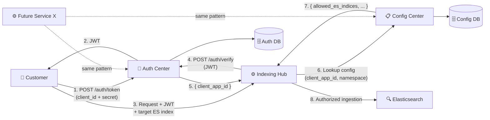
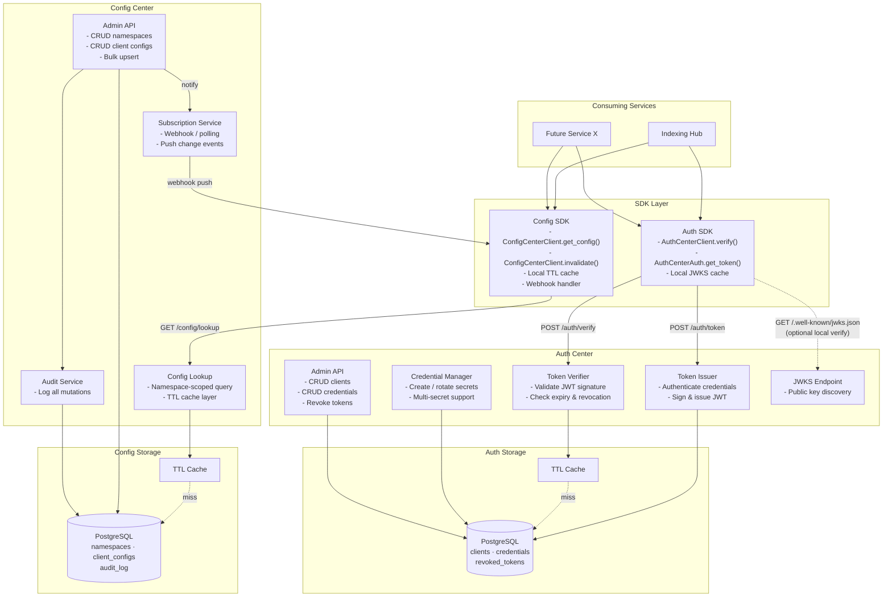
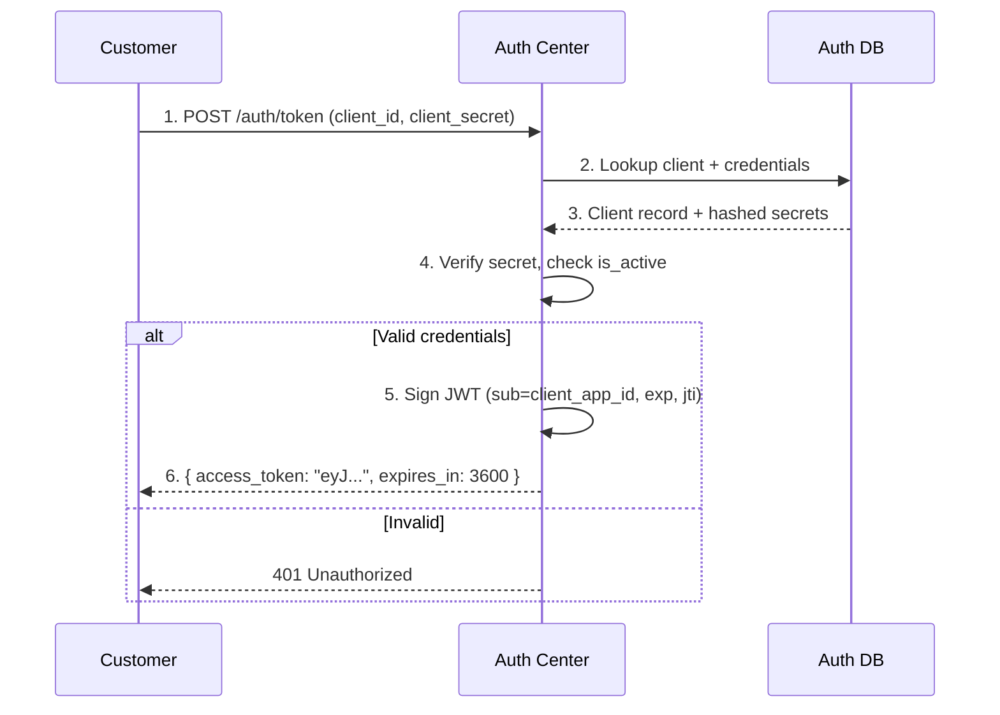
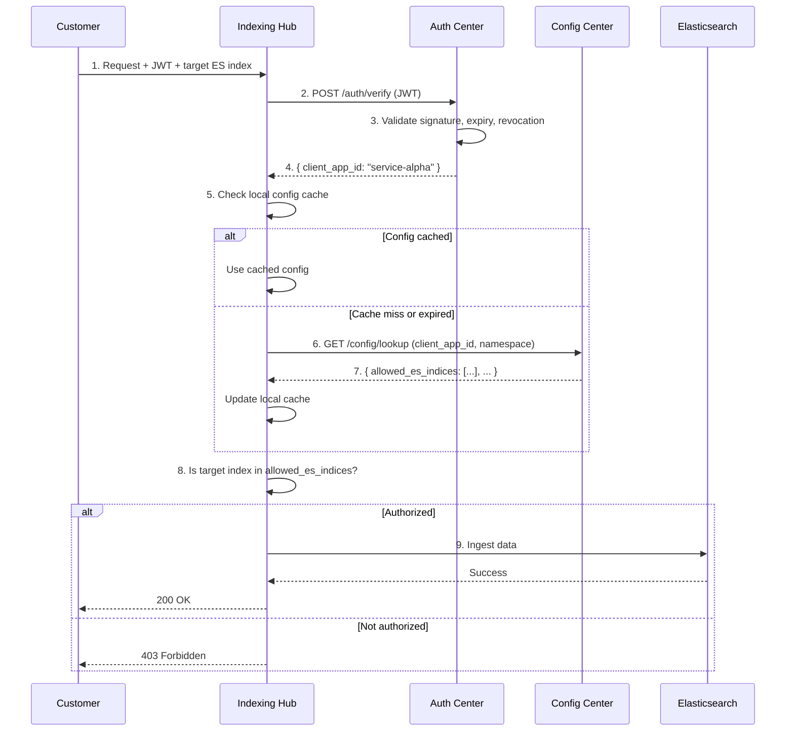
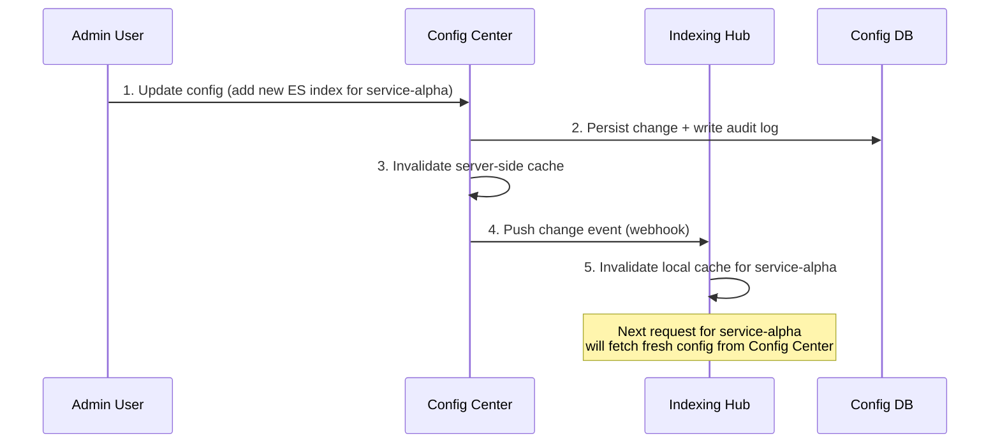
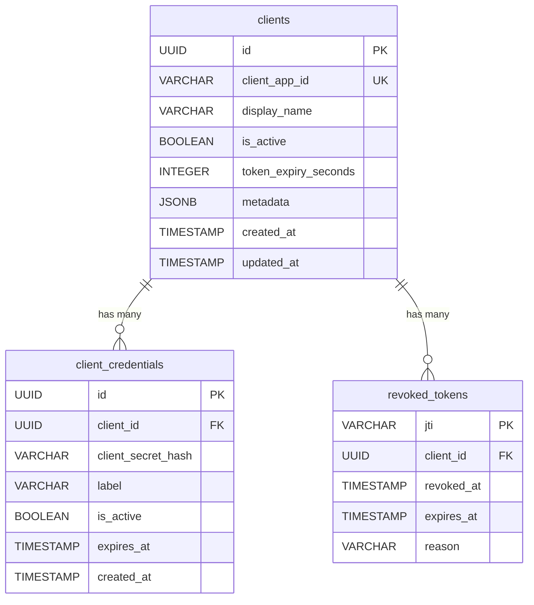
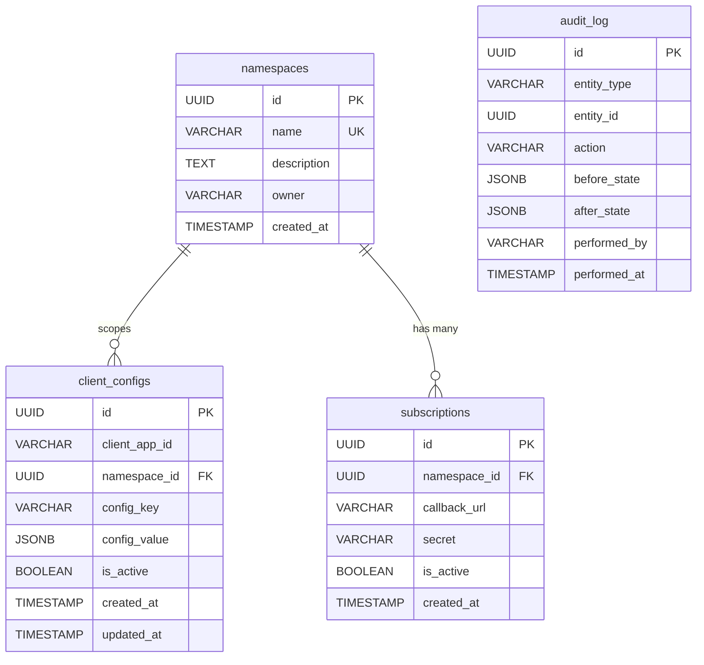

# Design Document: Auth Center & Config Center

**Date:** 23 March 2026
**Status:** Draft
**Version:** 3.0

---

## 1. Executive Summary

The Indexing Hub currently relies on a third-party external auth provider for token generation and hardcoded mappings between client applications and their dedicated Elasticsearch indices. Both are problematic: the external auth cannot be extended with custom metadata, and the hardcoded mappings require code changes and redeployments for every customer onboarding or configuration change.

This document proposes two **separate, centralized services** to replace the current setup:

1. **Auth Center** — A standalone authentication service that fully replaces the external auth provider. It registers clients, manages credentials, issues identity-only JWTs, and verifies tokens. Its single responsibility is answering: *"Is this client who they claim to be?"*

2. **Config Center** — A standalone configuration service that stores namespace-scoped key-value configuration for any consuming service. Consuming services (like the Indexing Hub) **subscribe** to the Config Center to retrieve their client-specific config (e.g. allowed ES indices) and can update config via its Admin API. Its single responsibility is answering: *"What is this client allowed/configured to do in my service?"*

By separating auth from config, each service has a clear, single responsibility, can scale independently, and can be adopted by future services without coupling.

---

## 2. Problem Statement

### 2.1 Current Workflow (Indexing Hub)

1. Customer authenticates with the external auth provider to obtain a token.
2. Customer sends the token and the target ES index name to the Indexing Hub.
3. Indexing Hub verifies the token and extracts the client application identity.
4. Indexing Hub looks up a **hardcoded mapping** to determine the allowed ES index for that client.
5. If the requested ES index does not match, an authentication error is returned.
6. If it matches, the ingestion request is processed.

### 2.2 Pain Points

**External auth is a black box:** The external auth provider is third-party and cannot be modified. We have no control over token structure, expiry policies, claims, or revocation. This forces every consuming service to maintain its own supplementary mapping logic.

**Hardcoded values are not scalable:** Every customer onboarding or config change requires a code change, review, and redeployment. At worst, each service ends up building its own ad-hoc config API — duplicating effort across teams.

**No single source of truth:** If multiple services need to know "what is client X allowed to do?", each service maintains its own copy. This leads to drift, inconsistency, and operational risk.

**Auth and config are entangled:** The current Indexing Hub mixes authentication (is this token valid?) with authorization/config (which index can this client use?) in the same code path. This makes both harder to maintain and impossible to reuse.

**Dependency on a third party for a critical path:** Authentication is on the critical path of every request. Depending on a third-party provider introduces availability risk, vendor lock-in, and limits customization.

---

## 3. Proposed Solution: Two Separate Services

### 3.1 Auth Center

A **standalone authentication microservice** that owns the full client auth lifecycle:

- **Client registration** — register client applications with credentials.
- **Token issuance** — authenticate client credentials and issue signed JWTs.
- **Token verification** — validate JWT signature, expiry, and revocation status.
- **Credential management** — support multiple secrets per client, rotation, and expiry.
- **Token revocation** — immediately invalidate compromised tokens.

The Auth Center does **not** know or care about what the client is allowed to do — that's the Config Center's job.

### 3.2 Config Center

A **standalone configuration microservice** that owns namespace-scoped client configuration:

- **Namespace registration** — each consuming service registers a namespace (e.g. `indexing-hub`).
- **Config CRUD** — store key-value pairs (JSONB) scoped to a client + namespace.
- **Config lookup** — consuming services query config for a given client and namespace.
- **Subscription model** — consuming services can subscribe (poll or webhook) to config changes so they maintain a local cache that stays in sync.

The Config Center does **not** issue or verify tokens — that's the Auth Center's job.

### 3.3 How They Work Together

The two services are independent but complementary. A consuming service like the Indexing Hub uses both:

1. **Auth Center** to verify "is this client authenticated?"
2. **Config Center** to check "what is this client configured to do in my service?"

Neither service depends on the other at runtime. They share a common key — `client_app_id` — which is the link between a client's identity and their configuration.

### 3.4 Token Design

Tokens are **identity-only JWTs** signed by the Auth Center:

```json
{
  "sub": "service-alpha",
  "iss": "auth-center",
  "iat": 1711152000,
  "exp": 1711155600,
  "jti": "unique-token-id"
}
```

No config is embedded. Config is always fetched from the Config Center, so changes take effect immediately without requiring a token refresh.

### 3.5 Design Principles

- **Separation of concerns:** Auth and config are independent services with no runtime coupling.
- **Service-agnostic:** The Config Center uses namespaces — no service-specific code anywhere.
- **Zero-code onboarding:** Adding a client or config entry is an API call, never a code change.
- **Single source of truth:** Auth Center owns identity; Config Center owns configuration.
- **Performance-first:** Both services use caching. Consuming services maintain a local config cache via subscription.
- **Fail-closed:** If either service is unreachable, consuming services deny the request.

---

## 4. Architecture Overview

### 4.1 System Context Diagram



### 4.2 Internal Component Diagram



### 4.3 Token Issuance Flow



### 4.4 Request Authorization Flow



### 4.5 Config Subscription Flow



---

## 5. Data Model

### Auth Center Database

#### 5.1 clients

| Column | Type | Nullable | Description |
|--------|------|----------|-------------|
| id | UUID (PK) | No | Internal unique identifier. |
| client_app_id | VARCHAR(255), UNIQUE | No | Public client identifier. Used as `sub` in JWTs. |
| display_name | VARCHAR(255) | Yes | Human-readable name. |
| is_active | BOOLEAN | No | Global kill switch. Inactive clients cannot authenticate. |
| token_expiry_seconds | INTEGER | No | Per-client JWT expiry. Default: 3600. |
| metadata | JSONB | Yes | Freeform metadata (contact email, team, notes). |
| created_at | TIMESTAMP | No | Record creation timestamp. |
| updated_at | TIMESTAMP | No | Last modification timestamp. |

#### 5.2 client_credentials

| Column | Type | Nullable | Description |
|--------|------|----------|-------------|
| id | UUID (PK) | No | Internal unique identifier. |
| client_id | UUID (FK → clients.id) | No | The client this credential belongs to. |
| client_secret_hash | VARCHAR(512) | No | Bcrypt/Argon2 hash. Never stored in plaintext. |
| label | VARCHAR(128) | Yes | Label for managing multiple secrets (e.g. "production"). |
| is_active | BOOLEAN | No | Allows disabling without deleting (for rotation). |
| expires_at | TIMESTAMP | Yes | Optional credential expiry. Null = no expiry. |
| created_at | TIMESTAMP | No | Record creation timestamp. |

A client can have multiple active credentials for zero-downtime secret rotation.

#### 5.3 revoked_tokens

| Column | Type | Nullable | Description |
|--------|------|----------|-------------|
| jti | VARCHAR(255) (PK) | No | The JWT ID of the revoked token. |
| client_id | UUID (FK → clients.id) | No | The client whose token was revoked. |
| revoked_at | TIMESTAMP | No | When the revocation occurred. |
| expires_at | TIMESTAMP | No | When the token would have expired. Rows cleaned up after this. |
| reason | VARCHAR(255) | Yes | Why the token was revoked. |

#### Auth Center ER Diagram



---

### Config Center Database

#### 5.4 namespaces

| Column | Type | Nullable | Description |
|--------|------|----------|-------------|
| id | UUID (PK) | No | Internal unique identifier. |
| name | VARCHAR(128), UNIQUE | No | Namespace key (e.g. `indexing-hub`). |
| description | TEXT | Yes | What this namespace is used for. |
| owner | VARCHAR(255) | Yes | Team or person responsible. |
| created_at | TIMESTAMP | No | Record creation timestamp. |

#### 5.5 client_configs

| Column | Type | Nullable | Description |
|--------|------|----------|-------------|
| id | UUID (PK) | No | Internal unique identifier. |
| client_app_id | VARCHAR(255) | No | The client this config belongs to. Matches `client_app_id` in Auth Center. |
| namespace_id | UUID (FK → namespaces.id) | No | The namespace this config belongs to. |
| config_key | VARCHAR(255) | No | The configuration key (e.g. `allowed_es_indices`). |
| config_value | JSONB | No | The configuration value. JSONB allows scalars, arrays, and objects. |
| is_active | BOOLEAN | No | Per-entry active flag. |
| created_at | TIMESTAMP | No | Record creation timestamp. |
| updated_at | TIMESTAMP | No | Last modification timestamp. |

**Constraints:** UNIQUE on `(client_app_id, namespace_id, config_key)`.

**Note:** The Config Center references `client_app_id` as a plain string, not a foreign key to the Auth Center's database. The two services have separate databases. The `client_app_id` is the shared contract between them.

#### 5.6 subscriptions

Tracks which consuming services subscribe to config change notifications.

| Column | Type | Nullable | Description |
|--------|------|----------|-------------|
| id | UUID (PK) | No | Internal unique identifier. |
| namespace_id | UUID (FK → namespaces.id) | No | The namespace being subscribed to. |
| callback_url | VARCHAR(512) | No | Webhook URL to notify on config changes. |
| secret | VARCHAR(255) | No | Shared secret for signing webhook payloads (HMAC). |
| is_active | BOOLEAN | No | Active flag. |
| created_at | TIMESTAMP | No | Record creation timestamp. |

#### 5.7 audit_log

| Column | Type | Nullable | Description |
|--------|------|----------|-------------|
| id | UUID (PK) | No | Unique identifier. |
| entity_type | VARCHAR(64) | No | `namespace`, `client_config`, or `subscription`. |
| entity_id | UUID | No | ID of the affected record. |
| action | VARCHAR(32) | No | `CREATE`, `UPDATE`, `DELETE`. |
| before_state | JSONB | Yes | Snapshot before. |
| after_state | JSONB | Yes | Snapshot after. |
| performed_by | VARCHAR(255) | No | Admin who made the change. |
| performed_at | TIMESTAMP | No | When the change happened. |

#### Config Center ER Diagram



---

## 6. API Design

### 6.1 Auth Center API

#### Customer-Facing

| Method | Endpoint | Description |
|--------|----------|-------------|
| POST | `/api/v1/auth/token` | Authenticate with client_id + client_secret, receive a signed JWT. |
| GET | `/api/v1/.well-known/jwks.json` | Public key(s) for local JWT verification by consuming services. |

#### Service-Facing

| Method | Endpoint | Description |
|--------|----------|-------------|
| POST | `/api/v1/auth/verify` | Verify a JWT. Returns `client_app_id` if valid. |
| POST | `/api/v1/auth/revoke` | Revoke a token by its `jti`. |

#### Admin API

| Method | Endpoint | Description |
|--------|----------|-------------|
| GET | `/api/v1/admin/clients` | List clients. Filter by `?search=`, `?is_active=`. |
| GET | `/api/v1/admin/clients/{id}` | Get a single client. |
| POST | `/api/v1/admin/clients` | Register a new client. |
| PUT | `/api/v1/admin/clients/{id}` | Update client (toggle active, change expiry). |
| DELETE | `/api/v1/admin/clients/{id}` | Deactivate client + revoke all tokens. |
| GET | `/api/v1/admin/clients/{id}/credentials` | List credentials (secrets never returned). |
| POST | `/api/v1/admin/clients/{id}/credentials` | Generate new credential (secret returned once). |
| DELETE | `/api/v1/admin/credentials/{id}` | Delete a credential. |
| POST | `/api/v1/admin/clients/{id}/credentials/rotate` | Generate new + schedule old for deactivation. |

#### Sample: POST /api/v1/auth/token

```json
// Request
{
  "client_id": "service-alpha",
  "client_secret": "sk_live_abc123..."
}

// Response (200 OK)
{
  "access_token": "eyJhbGciOiJSUzI1NiIs...",
  "token_type": "Bearer",
  "expires_in": 3600
}
```

#### Sample: POST /api/v1/auth/verify

```json
// Request
{
  "token": "eyJhbGciOiJSUzI1NiIs..."
}

// Response (200 OK)
{
  "client_app_id": "service-alpha",
  "is_active": true
}

// Response (401) — invalid, expired, or revoked
{
  "error": "invalid_token",
  "message": "Token signature invalid or token has expired."
}
```

---

### 6.2 Config Center API

#### Service-Facing

| Method | Endpoint | Description |
|--------|----------|-------------|
| GET | `/api/v1/config/lookup` | Lookup config. Params: `client_app_id`, `namespace`. Returns all active key-value pairs. |
| POST | `/api/v1/config/subscribe` | Subscribe to change notifications for a namespace. |
| DELETE | `/api/v1/config/subscribe/{id}` | Unsubscribe. |

#### Admin API

| Method | Endpoint | Description |
|--------|----------|-------------|
| GET | `/api/v1/admin/namespaces` | List all namespaces. |
| POST | `/api/v1/admin/namespaces` | Register a new namespace. |
| PUT | `/api/v1/admin/namespaces/{id}` | Update namespace metadata. |
| GET | `/api/v1/admin/configs` | List configs. Filter by `?client_app_id=`, `?namespace=`. |
| POST | `/api/v1/admin/configs` | Add a config entry. |
| PUT | `/api/v1/admin/configs/{id}` | Update a config entry. |
| DELETE | `/api/v1/admin/configs/{id}` | Soft-delete a config entry. |
| POST | `/api/v1/admin/configs/bulk` | Bulk upsert configs (batch onboarding). |

#### Sample: GET /api/v1/config/lookup?client_app_id=service-alpha&namespace=indexing-hub

```json
// Response (200 OK)
{
  "client_app_id": "service-alpha",
  "namespace": "indexing-hub",
  "config": {
    "allowed_es_indices": ["alpha-prod-index", "alpha-staging-index"],
    "rate_limit_per_minute": 1000,
    "max_batch_size": 500
  }
}
```

#### Sample: Webhook Payload (pushed to subscribers on config change)

```json
{
  "event": "config.updated",
  "namespace": "indexing-hub",
  "client_app_id": "service-alpha",
  "changed_keys": ["allowed_es_indices"],
  "timestamp": "2026-03-23T10:00:00Z",
  "signature": "sha256=abc123..."
}
```

The consuming service receives this webhook, invalidates its local cache for `service-alpha`, and fetches fresh config on the next request.

---

## 7. How the Indexing Hub Integrates (First Consumer)

### 7.1 Setup

```json
// 1. Register client in Auth Center
POST auth-center/api/v1/admin/clients
{ "client_app_id": "service-alpha", "display_name": "Service Alpha", "is_active": true }

// 2. Generate credentials in Auth Center
POST auth-center/api/v1/admin/clients/{id}/credentials
{ "label": "production" }
// → { "client_secret": "sk_live_..." }  (returned once)

// 3. Register namespace in Config Center
POST config-center/api/v1/admin/namespaces
{ "name": "indexing-hub", "owner": "platform-team" }

// 4. Add config in Config Center
POST config-center/api/v1/admin/configs
{ "client_app_id": "service-alpha", "namespace": "indexing-hub",
  "config_key": "allowed_es_indices",
  "config_value": ["alpha-prod-index", "alpha-staging-index"] }

// 5. Indexing Hub subscribes to config changes
POST config-center/api/v1/config/subscribe
{ "namespace": "indexing-hub",
  "callback_url": "https://indexing-hub.internal/webhooks/config-change",
  "secret": "whsec_..." }
```

### 7.2 Updated Indexing Hub Workflow

1. Customer authenticates with the **Auth Center** (`POST /auth/token`) and receives a JWT.
2. Customer sends the JWT + target ES index to the **Indexing Hub**.
3. Indexing Hub verifies the JWT with the **Auth Center** (`POST /auth/verify`) → gets `client_app_id`.
4. Indexing Hub checks its **local config cache** for `service-alpha` in namespace `indexing-hub`.
5. On cache miss, Indexing Hub fetches config from the **Config Center** (`GET /config/lookup`).
6. Indexing Hub checks if the requested ES index is in `allowed_es_indices`.
7. If yes → ingest. If no → 403.

Config stays in sync because the Indexing Hub subscribes to the Config Center's webhooks. When an admin updates a mapping, the Indexing Hub's cache is invalidated automatically.

### 7.3 Indexing Hub Code Change

```python
# BEFORE (external auth + hardcoded mappings)
ALLOWED_INDICES = {
    "service-alpha": ["alpha-prod-index"],
    "service-beta": ["beta-prod-index"],
}

def verify_index_access(client_app_id, requested_index):
    allowed = ALLOWED_INDICES.get(client_app_id, [])
    if requested_index not in allowed:
        raise HTTPException(403, "Not authorized")

# AFTER (Auth Center + Config Center)
async def verify_index_access(token, requested_index):
    # Step 1: Verify identity via Auth Center
    identity = await auth_client.verify(token)
    client_app_id = identity["client_app_id"]

    # Step 2: Get config via Config Center (with local cache)
    config = await config_client.get_config(client_app_id, namespace="indexing-hub")
    allowed = config.get("allowed_es_indices", [])

    if requested_index not in allowed:
        raise HTTPException(403, "Not authorized")
```

### 7.4 Indexing Hub Can Update Config

The Indexing Hub (or its operators) can update ES index mappings directly via the Config Center's Admin API — no redeployment needed:

```json
PUT config-center/api/v1/admin/configs/{config_id}
{
  "config_value": ["alpha-prod-index", "alpha-staging-index", "alpha-analytics-index"]
}
```

The webhook notifies the Indexing Hub, its cache refreshes, and the client can immediately ingest to the new index.

---

## 8. How Future Services Integrate

The pattern is the same every time — no changes to either Auth Center or Config Center:

**Step 1 — Register a namespace in Config Center:**

```json
POST config-center/api/v1/admin/namespaces
{ "name": "notification-hub", "owner": "comms-team" }
```

**Step 2 — Add client configs under your namespace:**

```json
POST config-center/api/v1/admin/configs
{ "client_app_id": "service-alpha", "namespace": "notification-hub",
  "config_key": "allowed_channels", "config_value": ["email", "sms"] }
```

**Step 3 — Subscribe to config changes:**

```json
POST config-center/api/v1/config/subscribe
{ "namespace": "notification-hub",
  "callback_url": "https://notif-hub.internal/webhooks/config" }
```

**Step 4 — Verify JWTs with Auth Center, fetch config from Config Center.** Customers use the same credentials and JWT — no new onboarding if they're already registered.

---

## 9. Caching Strategy

### 9.1 Auth Center Caching

- **Revocation list:** Cached in-memory (TTLCache) or Redis. Checked on every `/auth/verify` call.
- **Client records:** Cached for credential validation. TTL: 5 minutes.
- **Public keys (JWKS):** Consuming services that verify JWTs locally should cache the public key with a long TTL (1 hour+) and refresh when verification fails.

### 9.2 Config Center Caching

**Server-side (Config Center):** TTLCache or Redis for database query results. TTL: 5 minutes.

**Client-side (Consuming services):** Each consuming service maintains a local config cache. This is the primary performance optimization — most requests are served entirely from the local cache, with no network call to the Config Center.

Cache invalidation flow:

1. Admin updates config via Config Center Admin API.
2. Config Center writes to DB, invalidates its own cache, and fires a webhook to subscribers.
3. The consuming service receives the webhook and invalidates the specific `client_app_id` in its local cache.
4. The next request for that client triggers a fresh fetch from the Config Center.

### 9.3 Failure Modes

- **Auth Center unreachable:** Consuming services deny the request (fail-closed). Optionally, services that verify JWTs locally using the JWKS endpoint can continue to authenticate clients even if the Auth Center is down — but cannot check revocation.
- **Config Center unreachable:** If the local cache has a valid entry, the consuming service can serve from cache (fail-open with stale data). If no cache entry exists, deny the request.

---

## 10. Tech Stack

| Component | Technology | Rationale |
|-----------|-----------|-----------|
| Auth Center framework | Python / FastAPI | Async, high performance, matches existing stack. |
| Config Center framework | Python / FastAPI | Same stack for consistency. |
| Auth database | PostgreSQL | Reliable, proven for auth workloads. |
| Config database | PostgreSQL | JSONB support for flexible config values. |
| JWT signing | PyJWT + cryptography | RS256/ES256. Key management via cryptography lib. |
| Secret hashing | passlib (bcrypt/argon2) | Industry standard for credential hashing. |
| Caching | cachetools.TTLCache | In-process. Upgrade to Redis for multi-instance. |
| ORM / Migrations | SQLAlchemy + Alembic | Mature async support. |
| Containerization | Docker | Separate images for each service. |

---

## 11. Sample Project Structures

### Auth Center

```
auth-center/
├── app/
│   ├── main.py
│   ├── api/v1/
│   │   ├── auth.py               # /auth/token, /auth/verify, /auth/revoke
│   │   ├── jwks.py               # /.well-known/jwks.json
│   │   └── admin/
│   │       ├── clients.py
│   │       └── credentials.py
│   ├── models/
│   │   ├── client.py
│   │   ├── client_credential.py
│   │   └── revoked_token.py
│   ├── services/
│   │   ├── auth_service.py       # Credential verification
│   │   └── token_service.py      # JWT sign, verify, revoke
│   ├── crypto/
│   │   └── keys.py               # RSA/EC key pair management
│   ├── cache/
│   │   └── ttl_cache.py
│   └── db/
│       ├── session.py
│       └── migrations/
├── tests/
├── Dockerfile
└── docker-compose.yml
```

### Config Center

```
config-center/
├── app/
│   ├── main.py
│   ├── api/v1/
│   │   ├── config.py             # /config/lookup, /config/subscribe
│   │   └── admin/
│   │       ├── namespaces.py
│   │       └── configs.py
│   ├── models/
│   │   ├── namespace.py
│   │   ├── client_config.py
│   │   ├── subscription.py
│   │   └── audit_log.py
│   ├── services/
│   │   ├── config_service.py     # Lookup + cache
│   │   ├── subscription_service.py  # Webhook dispatch
│   │   └── audit_service.py
│   ├── cache/
│   │   └── ttl_cache.py
│   └── db/
│       ├── session.py
│       └── migrations/
├── tests/
├── Dockerfile
└── docker-compose.yml
```

---

## 12. SDK / Client Libraries

### For Consuming Services

```python
# Auth Center client
class AuthCenterClient:
    def __init__(self, base_url: str, timeout: int = 5):
        self._base_url = base_url
        self._http = httpx.AsyncClient(timeout=timeout)

    async def verify(self, token: str) -> dict:
        """Verify JWT. Returns { client_app_id, is_active }."""
        resp = await self._http.post(
            f"{self._base_url}/api/v1/auth/verify",
            json={"token": token},
        )
        resp.raise_for_status()
        return resp.json()


# Config Center client (with local cache + webhook support)
class ConfigCenterClient:
    def __init__(self, base_url: str, timeout: int = 5, cache_ttl: int = 300):
        self._base_url = base_url
        self._http = httpx.AsyncClient(timeout=timeout)
        self._cache = TTLCache(maxsize=1024, ttl=cache_ttl)

    async def get_config(self, client_app_id: str, namespace: str) -> dict:
        """Get config for a client in a namespace. Cached locally."""
        cache_key = f"{client_app_id}:{namespace}"
        if cache_key in self._cache:
            return self._cache[cache_key]

        resp = await self._http.get(
            f"{self._base_url}/api/v1/config/lookup",
            params={"client_app_id": client_app_id, "namespace": namespace},
        )
        resp.raise_for_status()
        result = resp.json()["config"]
        self._cache[cache_key] = result
        return result

    def invalidate(self, client_app_id: str, namespace: str):
        """Called by webhook handler to invalidate cached config."""
        self._cache.pop(f"{client_app_id}:{namespace}", None)
```

### For Customers (Token Management)

```python
class AuthCenterAuth:
    """Customer-facing SDK for obtaining and auto-refreshing tokens."""

    def __init__(self, base_url: str, client_id: str, client_secret: str):
        self._base_url = base_url
        self._client_id = client_id
        self._client_secret = client_secret
        self._token = None
        self._expires_at = 0

    async def get_token(self) -> str:
        if self._token and time.time() < self._expires_at - 60:
            return self._token

        resp = await httpx.AsyncClient().post(
            f"{self._base_url}/api/v1/auth/token",
            json={"client_id": self._client_id, "client_secret": self._client_secret},
        )
        resp.raise_for_status()
        data = resp.json()
        self._token = data["access_token"]
        self._expires_at = time.time() + data["expires_in"]
        return self._token
```

---

## 13. Security Considerations

### Auth Center

**JWT signing keys:** RS256 or ES256. Private key for signing only; public key distributed via JWKS endpoint. Store keys securely (secrets manager). Rotate periodically.

**Client secrets:** Hashed with bcrypt/Argon2 before storage. Plaintext returned once at creation. Support multiple active credentials for zero-downtime rotation.

**Rate limiting:** `/auth/token` must be rate-limited with exponential backoff on failed attempts per `client_id` to prevent brute-force attacks.

**Token revocation:** Deactivating a client revokes all active tokens immediately.

### Config Center

**Admin API access control:** Protected by API keys, OAuth2 scopes, or RBAC — separate from both customer tokens and Auth Center admin access.

**Webhook security:** Payloads signed with HMAC (shared secret per subscription). Consuming services must verify the signature before trusting the payload.

**Audit trail:** Every mutation logged with admin identity and timestamp.

**Input validation:** Config keys and values validated. ES index names checked against allowlist patterns.

### Network

**Auth Center:** `/auth/token` is customer-facing (may be public). `/auth/verify` and Admin API should be internal-only.

**Config Center:** All endpoints should be internal-only. No customer-facing exposure.

---

## 14. Monitoring & Alerting

### Auth Center Metrics

- `auth.token.issued` — tokens issued (by client_app_id)
- `auth.token.failed` — failed auth attempts (critical for detecting brute force)
- `auth.verify.count` — verify calls (by result: success/expired/revoked)
- `auth.verify.latency_ms` — p50, p95, p99
- `auth.revoke.count` — token revocations

### Config Center Metrics

- `config.lookup.count` — lookup calls (by namespace)
- `config.cache.hit_rate` — server-side cache hit ratio (target: >90%)
- `config.webhook.dispatched` — webhooks sent (by namespace)
- `config.webhook.failed` — webhook delivery failures (needs retry/alerting)
- `admin.mutation.count` — write operations (by entity type and action)

### Alerts

- Elevated `auth.token.failed` → possible brute-force attack or misconfigured credentials.
- Elevated 401 rates on verify → expired tokens, revoked clients, or clock skew.
- `config.webhook.failed` sustained → a consuming service's webhook endpoint is down; config changes won't propagate.
- Database connection failures on either service → immediate alert.

---

## 15. Migration Plan

### Phase 1: Build Auth Center (Week 1–2)

- Set up project, database schema, Alembic migrations.
- Implement JWT signing, `/auth/token`, `/auth/verify`, `/auth/revoke`, JWKS endpoint.
- Implement Admin API (clients, credentials).
- Write unit and integration tests.
- Register all existing clients and generate credentials.

### Phase 2: Build Config Center (Week 2–3)

- Set up project, database schema, Alembic migrations.
- Implement `/config/lookup`, subscription/webhook system, Admin API.
- Write unit and integration tests.
- Register the `indexing-hub` namespace.
- Seed all existing hardcoded client-to-index mappings.

### Phase 3: Dual-Mode in Indexing Hub (Week 4)

- Integrate Auth Center SDK and Config Center SDK.
- Run in **dual-mode**: accept both external auth tokens AND Auth Center JWTs.
- Config lookup checks Config Center first, falls back to hardcoded values.
- Log all requests, noting which auth + config path was used.
- Subscribe to Config Center webhooks.
- Deploy to staging and validate.

### Phase 4: Customer Migration (Week 5–6)

- Distribute new credentials to all customers.
- Customers switch to Auth Center for token generation.
- Monitor dual-mode logs — track migration progress.
- Provide support during transition.

### Phase 5: Cut Over (Week 7)

- Remove external auth support and hardcoded mappings from Indexing Hub.
- Decommission external auth provider dependency.
- Update documentation and runbooks.
- Communicate completion to stakeholders.

### Phase 6: Onboard Additional Services (Ongoing)

- New services register a namespace in Config Center and integrate via SDKs.
- No changes to Auth Center or Config Center needed.

---

## 16. Rollback Strategy

During Phases 3–4 (dual-mode), rollback is a feature flag: `AUTH_CENTER_ENABLED=false` reverts to external-auth-only, `CONFIG_CENTER_ENABLED=false` reverts to hardcoded mappings. Both old and new paths are active during this period.

After Phase 5, the dual-mode code can be restored from the last commit before cutover. Both services' databases can be restored from backups, and the Config Center's audit log provides a full history of all changes.

---

## 17. Summary

This design splits the system into two independent, centralized services. The **Auth Center** fully replaces the external auth provider — it owns client registration, credential management, JWT issuance, verification, and revocation. The **Config Center** owns namespace-scoped client configuration — consuming services subscribe to it for config changes and can update mappings via its Admin API. The two services share `client_app_id` as a common key but have no runtime dependency on each other. The Indexing Hub is the first consumer, but any future service follows the same pattern: verify the JWT with the Auth Center, fetch config from the Config Center. The migration is phased over ~7 weeks with a dual-mode safety net, and both services are designed to be independently deployable, scalable, and operationally simple.
