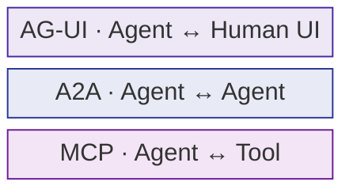
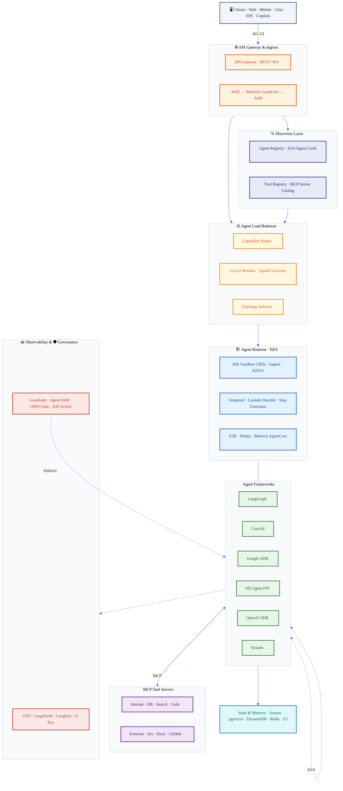
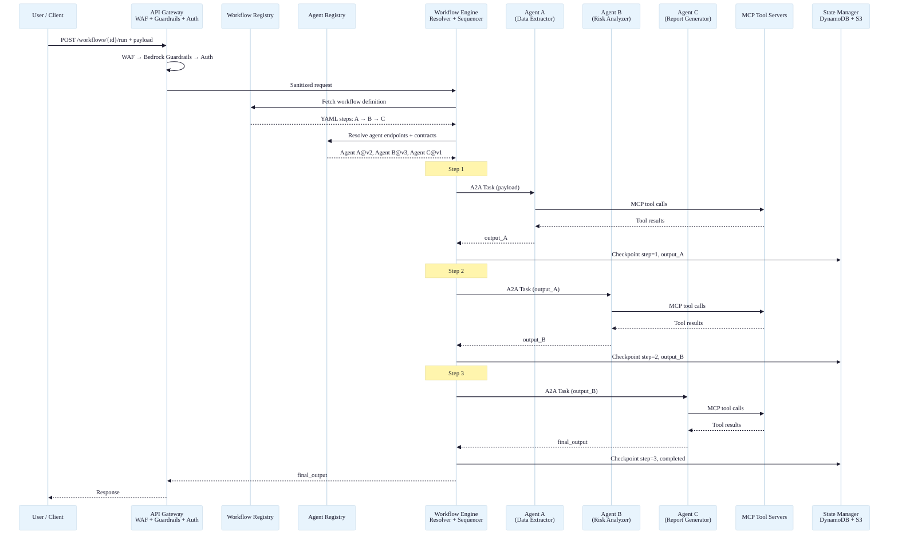
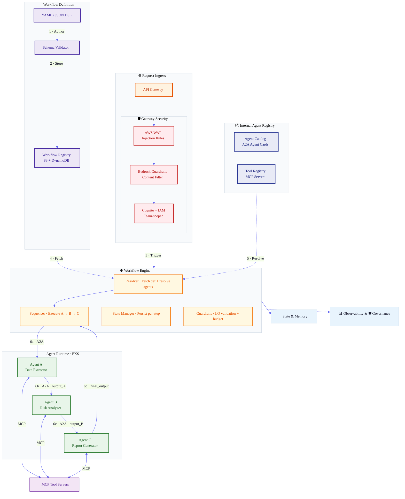
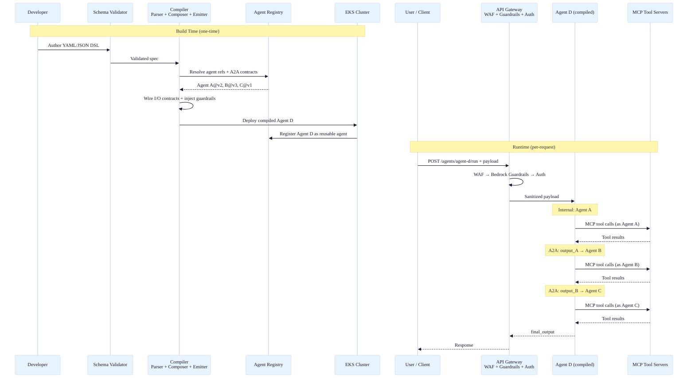
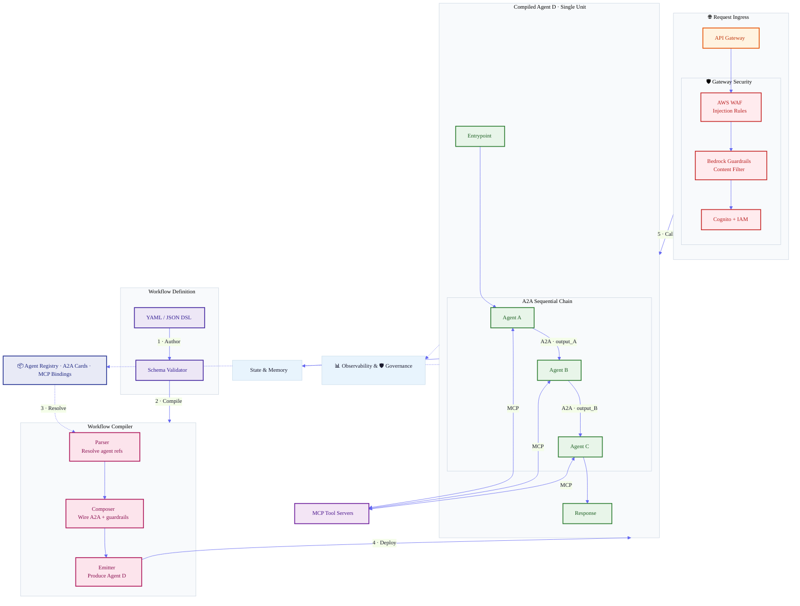
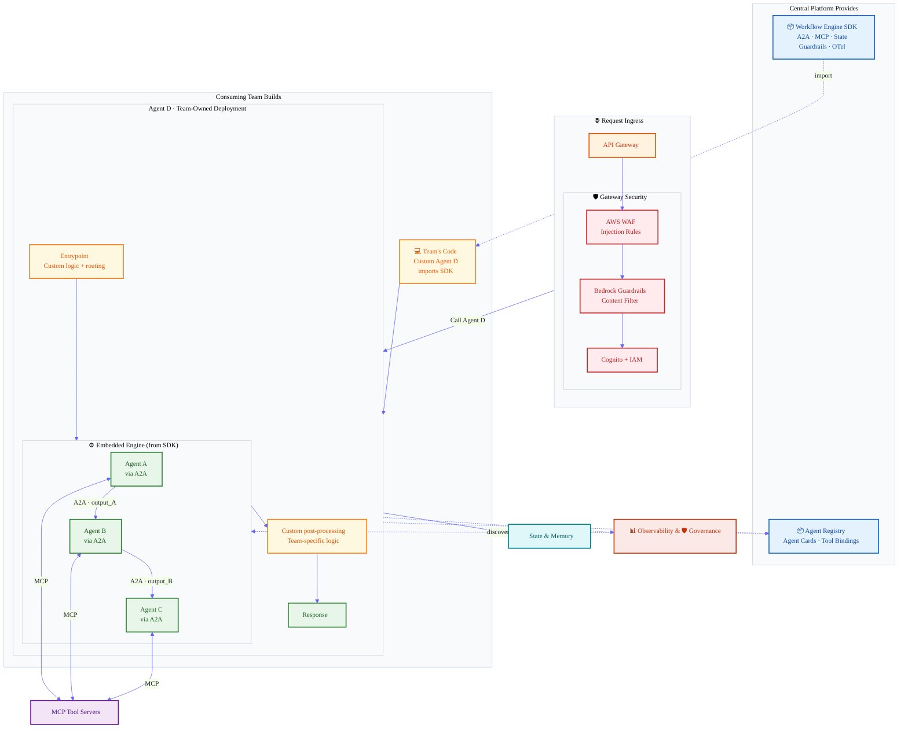
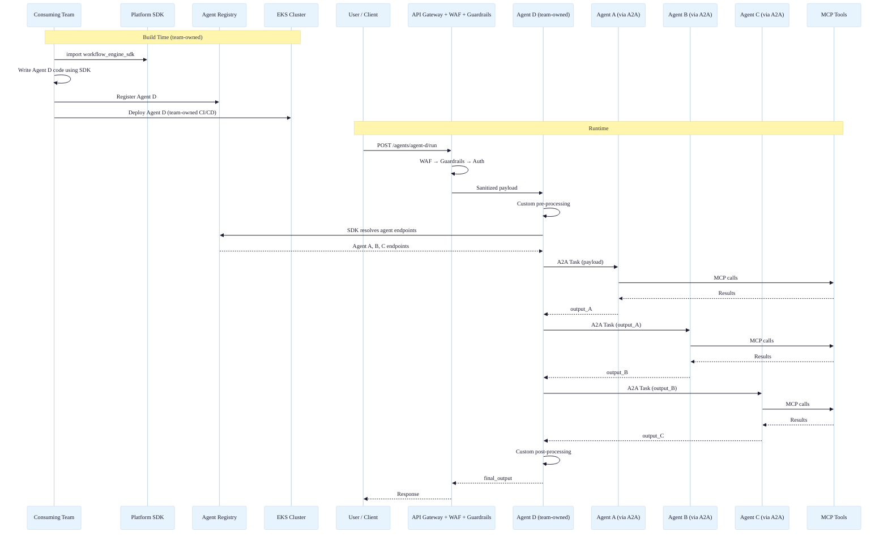
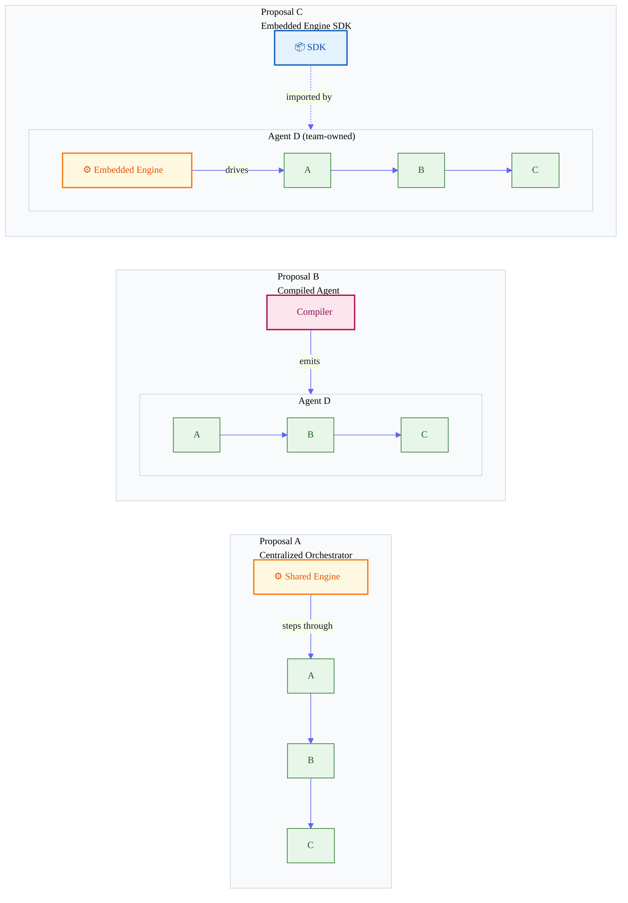

# The Architecture of AI Agent Ecosystems: Research, Infrastructure & Platform Design

**Author:** Song · AI/ML Platform Team  
**Date:** March 2026  
**Scope:** Academic & architectural deep dive — agent orchestration, reusable agent infrastructure, and platform design for enterprise AI/ML services

---

## Table of Contents

1. [Executive Summary](#1-executive-summary)
2. [The Protocol Stack: MCP, A2A, AG-UI](#2-the-protocol-stack)
3. [Agent & Tool Discovery](#3-agent--tool-discovery)
4. [Infrastructure & Deployment](#4-infrastructure--deployment)
5. [The Framework Landscape](#5-the-framework-landscape)
6. [Governance, Observability & Security](#6-governance-observability--security)
7. [Multi-Agent Topologies: What the Research Says](#7-multi-agent-topologies)
8. [Cloud Provider Reference Architectures](#8-cloud-provider-reference-architectures)
9. [Full Platform Architecture (Detailed)](#9-full-platform-architecture-detailed)
10. [Proposal A: Reusable Workflow Orchestrator](#10-proposal-a-reusable-workflow-orchestrator)
11. [Proposal B: Compiled Agent](#11-proposal-b-compiled-agent)
12. [Proposal C: Embedded Engine SDK](#12-proposal-c-embedded-engine-sdk-team-owned-agent-d)
13. [Proposal Comparison: A vs B vs C](#13-proposal-comparison-a-vs-b-vs-c)
14. [Deep Dive: Workflow Engine](#14-deep-dive-workflow-engine)
15. [Deep Dive: State & Memory](#15-deep-dive-state--memory)
16. [Recommendations & Next Steps](#16-recommendations--next-steps)

---

## 1. Executive Summary

The AI agent ecosystem has reached an inflection point. Two complementary protocols — Anthropic's MCP for agent-to-tool integration and Google's A2A for agent-to-agent communication — have emerged as de facto standards, both now stewarded by the Linux Foundation's Agentic AI Foundation (AAIF). The infrastructure layer is crystallizing around durable execution engines, microVM sandboxes, and Kubernetes-native agent runtimes, while observability and governance tooling races to keep pace with the security challenges that autonomous agent fleets introduce.

This document consolidates industry research, architectural patterns, and two concrete platform proposals (Reusable Workflow Orchestrator vs. Compiled Agent) for building a centralised, reusable agent platform. It is structured to serve as both a reference document and a decision record.

Key findings:

- The protocol stack has achieved surprising consensus: MCP (97M monthly SDK downloads) + A2A (150+ supporting organizations) under Linux Foundation governance.
- Google DeepMind's scaling research shows multi-agent systems are not universally superior — single agents outperform all multi-agent variants on sequential reasoning by 39–70%.
- Only 2–5% of enterprises have achieved full-scale agent deployment despite 85% experimenting.
- Governance, not infrastructure, is the binding constraint on production adoption.

---

## 2. The Protocol Stack

Three protocols form the emerging communication layer for agent ecosystems. They are complementary, not competing.

### MCP — Model Context Protocol (Agent ↔ Tool)

MCP standardizes how agents connect to tools and data sources. Originated by Anthropic in November 2024 and donated to the Linux Foundation by December 2025.

**Architecture:** Client-server model using JSON-RPC 2.0 over Streamable HTTP or stdio. Exposes three primitives: Tools (model-controlled actions), Resources (application-controlled data), and Prompts (user-controlled templates).

**Adoption:** 97 million monthly SDK downloads, 10,000+ active servers, first-class support in Claude, ChatGPT, Cursor, Gemini, and VS Code.

**Current spec:** v1.27 (2026), under AAIF governance.

### A2A — Agent-to-Agent Protocol (Agent ↔ Agent)

A2A addresses horizontal agent interoperability. Originated by Google in April 2025, donated to the Linux Foundation.

**Architecture:** Agent Cards (JSON metadata at `/.well-known/agent.json`) advertise capabilities, auth requirements, and supported modalities. Communication flows through a four-step lifecycle: discovery → task initiation → status updates via messages → artifact delivery. Version 0.3 added gRPC support and signed security cards.

**Adoption:** 150+ supporting organizations including Salesforce, SAP, ServiceNow, PayPal, Adobe, and AWS. IBM's ACP protocol merged into A2A, reducing fragmentation.

### AG-UI — Agent-to-User Interface Protocol

AG-UI standardizes the communication between agents and human-facing interfaces (web, mobile, chat, IDE). Still early-stage but fills the critical gap between backend agent systems and frontend rendering.

### Additional Conventions

- **AGENTS.md** (OpenAI, August 2025): Markdown convention for project-specific agent instructions. Adopted by 60,000+ open-source projects.
- **ANP (Agent Network Protocol):** Uses W3C Decentralized Identifiers for cryptographic agent identity.
- **W3C AI Agent Protocol Community Group:** Draft specifications in progress since June 2025.

### The Layered Model



---

## 3. Agent & Tool Discovery

Discovery is following the microservices trajectory: static config → centralized registries → federated, semantic discovery.

### Discovery Patterns

**Decentralized well-known URIs:** A2A's `/.well-known/agent.json` convention. Any agent publishes capabilities at a predictable URL. Works like `robots.txt` for agents.

**Centralized registries:** The official MCP Registry (preview September 2025) operates as a federated metaregistry. Enterprise variants include Kong's MCP Registry (security + identity controls), TrueFoundry's AI Agent Registry (Gartner 2025 Market Guide), and the open-source MCP Gateway Registry (agent registry + A2A hub + OAuth via Keycloak/Entra).

**Agent marketplaces:** Google Cloud AI Agent Marketplace (A2A-compliant agents, Gemini-powered search), Oracle AI Agent Marketplace (21-point enterprise readiness checklist), Salesforce AgentExchange.

**Federated discovery:** MIT's NANDA project implements "DNS for agents" with AgentFacts (signed, schema-validated JSON-LD) verified using W3C Verifiable Credentials. The AGNTCY project (Linux Foundation, 65+ companies) provides complementary infrastructure for discovery, identity, and quantum-safe messaging.

### Standards Bodies

- **NIST AI Agent Standards Initiative** (February 2026): Three pillars — industry-led standards, open-source protocol growth, agent safety research.
- **W3C AI Agent Protocol Community Group**: Draft specifications with contributors from Google, Huawei, and Microsoft.
- **Linux Foundation AAIF**: Neutral governance for MCP, A2A, Goose, and AGENTS.md.

---

## 4. Infrastructure & Deployment

Production agent infrastructure crystallizes around three deployment models.

### Kubernetes-Native Patterns

**Agent Sandbox CRD** (SIG Apps, Google): Introduced a `Sandbox` CRD with kernel-level isolation (gVisor/Kata), lifecycle management (scale-to-zero, suspend/resume), and `SandboxWarmPool` for sub-1-second startup.

**kagent** (CNCF-adjacent): Agents as Kubernetes custom resources — an `Agent` CRD combining system prompt, tools, and LLM config, with MCP-compatible `ToolServers` and built-in OTel observability. Engine runs on Google ADK.

**CNCF survey (January 2026):** 82% of container users run K8s in production; 66% of orgs using GenAI rely on K8s for inference workloads.

### Durable Execution Engines

**Temporal** ($5B valuation, $300M Series D): Powers OpenAI's Codex agent. Separates deterministic Workflows from non-deterministic Activities. Append-only Event History enables exact replay from any failure point.

**AWS Lambda Durable Functions** (re:Invent 2025): `@durable_step` decorators, automatic retry, suspend up to 1 year without compute charges.

**Inngest:** Serverless-first durable execution on Vercel/Cloudflare/Lambda.

**Restate:** Durable execution proxy with push-based semantics and durable promises for human-in-the-loop.

### MicroVM Sandboxes

**E2B** (market leader): 15 million sandbox sessions/month, Firecracker microVM isolation, ~50% Fortune 500 adoption. $21M Series A (July 2025).

**Modal:** gVisor containers scaling to 50,000+ concurrent in seconds.

**Daytona:** Sub-90ms sandbox creation. $24M Series A (February 2026).

---

## 5. The Framework Landscape

### Major Frameworks (2026)

| Framework | Architecture | Strength | Scale Indicator |
|-----------|-------------|----------|-----------------|
| **LangGraph** | Graph-based state machine | Production-grade, checkpointing, LangSmith | 34.5M downloads/year |
| **CrewAI** | Role-based multi-agent | Visual editor, enterprise AMP | 1.1B tasks in Q3 2025 |
| **MS Agent Framework** | SK + AutoGen merger | .NET + Python, Azure-native | 70K+ orgs on Foundry |
| **Google ADK** | Hierarchical agent tree | Multi-language (Py/TS/Go/Java), A2A-native | Powers Agentspace |
| **OpenAI Agents SDK** | Handoffs + Guardrails | Clean DX, Responses API | ~19K GitHub stars |
| **Strands SDK** | AWS-native lightweight | MCP + A2A, Bedrock integration | Official AWS SDK |

**Critical observation:** Every major framework now supports both MCP and A2A, dissolving framework lock-in through protocol-level interoperability.

---

## 6. Governance, Observability & Security

### OWASP Top 10 for Agentic Applications (December 2025)

Published by 100+ security researchers, covering: Agent Goal Hijack, Tool Misuse, Privilege Abuse, Supply Chain Vulnerabilities, Cascading Failures, Memory Poisoning, Insecure Inter-Agent Communication, Rogue Agents, and Human-Agent Trust Exploitation.

**Prompt injection remains the #1 vulnerability** — found in 73% of production AI deployments. A landmark paper by 14 researchers from OpenAI, Anthropic, and Google DeepMind showed adaptive attacks bypass 12 published defenses with >90% success rate.

### Observability Stack

| Tool | Type | Strength |
|------|------|----------|
| **LangSmith** | Commercial | Step-by-step tracing, zero overhead |
| **Langfuse** | Open-source (MIT) | 50+ integrations, self-hosted |
| **Arize Phoenix** | Open-source | Drift detection, hallucination scoring |
| **Helicone** | Commercial | 2-minute setup, response caching |
| **OpenTelemetry GenAI** | Standard | `gen_ai.*` semantic conventions (v1.37+) |

**OpenTelemetry GenAI Semantic Conventions** are becoming the lingua franca: standardized attributes for model spans and agent spans, with active proposals covering Tasks, Actions, Teams, Artifacts, and Memory.

### Governance Frameworks

**Five-pillar model:** Inventory (catalog all agents) → Identity (per-agent credentials) → Least Privilege (autonomy earned) → Observability (real-time anomaly detection) → Continuous Compliance (automated checks).

**Tooling:** Credo AI Agent Registry, NVIDIA NeMo Guardrails (Colang, 5 rail types), Lakera Guard, Palo Alto Prisma AIRS, CrowdStrike Falcon AIDR.

**Regulatory:** EU AI Act full enforcement August 2026. FINRA 2026 report addresses AI agents explicitly. CSA Agentic Trust Framework applies Zero Trust with agent maturity levels (Intern → Principal).

---

## 7. Multi-Agent Topologies

### Google DeepMind & MIT Scaling Science (December 2025)

The landmark paper "Towards a Science of Scaling Agent Systems" derived quantitative scaling principles from 180 configurations across GPT, Gemini, and Claude model families.

| Topology | Error Amplification | Best For | Example |
|----------|-------------------|----------|---------|
| **Centralized Orchestrator** | 4.4× | Well-defined workflows, parallelizable tasks (+80.8%) | LangGraph supervisor, Bedrock multi-agent |
| **Decentralized Mesh** | 17.2× | Dynamic, exploratory tasks (+9.2%) | A2A peer-to-peer discovery |
| **Hierarchical** | Moderate | Balanced control + scale | Google ADK agent trees |
| **Blackboard** | Low | Loosely-coupled collaboration (+13–57%) | AWS Arbiter Pattern |

**Critical finding:** All multi-agent variants degraded performance 39–70% on sequential reasoning compared to single agents. The researchers' predictive model identifies optimal architecture for 87% of unseen tasks.

**Implication for our platform:** Since our workflow execution is strictly sequential (A → B → C), collapsing the chain into a single agent boundary (Proposal B) aligns with this finding.

---

## 8. Cloud Provider Reference Architectures

### AWS — Modularity & Framework-Agnosticism

Bedrock AgentCore (GA October 2025): Serverless runtime deploying agents from any framework. Six managed services: Runtime (8hr windows), Memory (episodic), Gateway (APIs + MCP), Identity (OAuth), Observability (OTel), Policy (natural language authoring). Strands SDK as AWS's lightweight framework.

### Azure — Enterprise-First Integration

Microsoft Agent Framework (SK + AutoGen merger). Azure AI Foundry Agent Service (70K+ orgs). Copilot Studio (230K+ orgs, low-code). Microsoft Entra Agent ID for managed agent identity.

### GCP — Open Ecosystem

ADK fully open-source (Py/TS/Go/Java). A2A creator and early MCP adopter. Vertex AI Agent Engine as managed runtime. Agent Garden for curated samples. Cloud API Registry for MCP server management.

---

## 9. Full Platform Architecture (Detailed)

The complete platform architecture spans 8 layers from client to governance.



---

## 10. Proposal A: Reusable Workflow Orchestrator

### Concept

A **Workflow Engine** sits between the API Gateway and Agent Runtime. Users define workflows in YAML/JSON DSL. At runtime, the engine fetches the definition, resolves agents from the registry, and steps through them sequentially, passing each agent's output as the next agent's input via A2A.

### Request Flow



### Architecture Diagram



### Example DSL

```yaml
workflow: credit-risk-review
version: 1.2
timeout: 300s
retry_policy:
  max_retries: 2
  backoff: exponential

steps:
  - id: extract
    agent: data-extractor@v2
    input: $request.payload
    timeout: 60s

  - id: analyze
    agent: risk-analyzer@v3
    input: $steps.extract.output
    timeout: 120s

  - id: report
    agent: report-generator@v1
    input: $steps.analyze.output
    timeout: 60s

output: $steps.report.output
```

---

## 11. Proposal B: Compiled Agent

### Concept

A **Compiler** takes the same YAML/JSON DSL, resolves all agent references and I/O contracts at build time, and emits a single deployable **Agent D** that internally chains A → B → C via A2A. At runtime, callers hit Agent D's single endpoint — they don't know the internal structure.

### Request Flow



### Architecture Diagram



---

## 12. Proposal C: Embedded Engine SDK (Team-Owned Agent D)

### Concept

The consuming team builds and deploys their own **Agent D** using an **Embedded Workflow Engine SDK** provided by the central platform. Agent D is a custom agent that the team writes, owns, and deploys — but internally it uses the platform's SDK to discover agents from the registry, chain them via A2A, and get built-in checkpointing, guardrails, and observability.

Think of it as: every custom agent ships with its own micro-engine. The platform provides the engine as a library, not as shared infrastructure.

This creates three sub-variants depending on how much the SDK abstracts away:

- **C1 (Thin SDK):** Team writes their own orchestration code. SDK provides helpers for A2A calls, MCP tool access, and retry. Team wires the chain logic.
- **C2 (Medium SDK):** SDK handles A2A calls, I/O validation, state, and checkpointing. Team declares step order and input/output mappings in code.
- **C3 (Thick SDK):** Full engine embedded as a library. Team declares steps declaratively in code (similar to YAML but in Python/TS). SDK handles everything.

### Architecture Diagram



### Request Flow



### Example Code (C2 — Medium SDK)

```python
from platform_sdk import WorkflowEngine, step, agent_call

class CreditRiskAgent:
    def __init__(self):
        self.engine = WorkflowEngine(
            name="credit-risk-review",
            checkpoint_store="dynamodb",
            otel_enabled=True
        )

    @step(timeout=60, retry=2)
    async def extract(self, payload):
        return await agent_call("data-extractor@v2", payload)  # A2A

    @step(timeout=120, retry=2)
    async def analyze(self, extracted_data):
        return await agent_call("risk-analyzer@v3", extracted_data)  # A2A

    @step(timeout=60, retry=1)
    async def report(self, analysis):
        result = await agent_call("report-generator@v1", analysis)  # A2A
        # Custom post-processing (team-specific)
        result["reviewed_by"] = "credit-risk-team"
        result["timestamp"] = datetime.utcnow()
        return result

    async def run(self, payload):
        return await self.engine.execute([
            self.extract,
            self.analyze,
            self.report
        ], payload)
```

### Sub-Variant Comparison: C1 vs C2 vs C3

#### Dimension 1: Who Wires the Chain Logic?

| | C1: Team writes code | C2: Team configures via SDK | C3: Team declares, SDK auto-wires |
|---|---|---|---|
| **How it works** | Team writes raw A2A calls, if/else, error handling manually. SDK provides client helpers. | Team uses `@step` decorators and `agent_call()`. SDK handles A2A protocol, retry, checkpoints. | Team provides a step list (like YAML but in code). SDK resolves agents, validates contracts, wires everything. |
| **Pros** | Maximum flexibility. Team can add conditional logic, custom branching, parallel fan-out, anything. No abstraction leaks. | Good balance — team controls step order and can inject custom logic between steps, but doesn't deal with A2A plumbing. | Lowest effort for team. Almost no boilerplate. Consistent patterns across all teams. |
| **Cons** | High effort per team. Every team rebuilds retry, checkpointing, observability. Inconsistent patterns across org. | Some flexibility lost — custom branching requires breaking out of the decorator pattern. | Least flexible. Can't easily add custom logic between steps. If the SDK doesn't support a pattern, team is stuck. |
| **Best for** | Teams with complex, non-linear workflows that need full control. | Most internal teams — standard sequential chains with occasional custom logic. | Simple chains where speed of delivery matters more than customization. |

#### Dimension 2: Who Builds & Deploys Agent D?

| | Team builds + deploys | Central platform deploys for them | Team builds, registers with central platform |
|---|---|---|---|
| **How it works** | Team owns the full CI/CD pipeline. They import the SDK, write Agent D, build a container, deploy to their own EKS namespace. | Team provides config (YAML or code). Central platform compiles, containerizes, and deploys Agent D. Team has no deployment responsibility. | Team writes and builds Agent D. Before deploying, they must register with the platform (schema validation, security scan, policy check). |
| **Pros** | Full ownership and autonomy. Team controls release cadence, canary rollouts, rollback. No dependency on platform team's deployment pipeline. | Zero DevOps burden on consuming teams. Guaranteed consistent deployment patterns. Platform team can enforce infra standards. | Teams retain autonomy while platform ensures governance. Registration acts as a quality gate — no unregistered agents in production. |
| **Cons** | Platform team has limited visibility into deployments. Risk of inconsistent infra patterns, security misconfigurations, ungoverned agents. | Teams lose deployment autonomy. Platform team becomes a bottleneck. "Throw config over the wall" dynamic — hard to debug when something goes wrong. | Registration process adds friction. Teams may resist the governance overhead. Need to design the registration gate carefully to avoid it becoming a bottleneck. |
| **Best for** | Mature teams with strong DevOps practices who need fast iteration. | Teams without DevOps capability, or when strict infra standardization is required. | Most organizations — balances autonomy with governance. This is the recommended default. |

#### Dimension 3: How Much Does the Embedded Engine Abstract?

| | Thin: helpers only | Medium: SDK handles plumbing | Thick: full engine as library |
|---|---|---|---|
| **What SDK provides** | A2A client, MCP client, retry util, OTel trace helper. Team writes the glue. | A2A calls, I/O schema validation, checkpointing, OTel spans, budget enforcement. Team defines step order. | Complete engine: step resolution, sequencing, checkpointing, guardrails, observability. Team just declares steps. |
| **Lines of team code** | High (~200+ lines for a 3-step chain) | Medium (~50–80 lines) | Low (~20–30 lines) |
| **Pros** | No magic. Team understands exactly what's happening. Easy to debug. No abstraction leaks. | Sweet spot — eliminates boilerplate while keeping team in control of flow. Consistent observability and checkpointing across all agents. | Fastest time-to-delivery. Guaranteed consistency. Platform team can upgrade the engine SDK and all agents benefit. |
| **Cons** | Every team reinvents retry, checkpointing, observability. Inconsistent quality across teams. High maintenance burden. | Team must learn the SDK's patterns and conventions. Some lock-in to the SDK's abstractions. | Hardest to debug when something goes wrong inside the engine. Abstraction leaks are painful. SDK upgrades can break teams if API changes. |
| **Upgrade story** | No centralized upgrade path — each team manages their own. | SDK upgrade = team bumps dependency version. Engine improvements propagate automatically. | Same as medium, but higher risk — engine is doing more, so breaking changes are more impactful. |
| **Best for** | Platform teams or advanced teams building non-standard patterns. | Most internal teams — the recommended default. | Teams that want maximum speed and are okay with less control. |

---

## 13. Proposal Comparison: A vs B vs C

### Three Proposals at a Glance



### Full Comparison Matrix

| Dimension | A: Centralized Orchestrator | B: Compiled Agent | C: Embedded Engine SDK |
|-----------|---------------------------|-------------------|----------------------|
| **Who defines the workflow** | YAML/JSON DSL | YAML/JSON DSL | Code (using SDK) |
| **Who owns the engine** | Central platform (shared infra) | Compiler absorbs engine at build time | Team owns it (engine is a library) |
| **Who deploys Agent D** | N/A — engine calls agents directly | Central platform compiles + deploys | Team builds + deploys |
| **Runtime model** | Engine steps through agents per-request | Single pre-compiled unit | Team's agent with embedded engine |
| **Caller experience** | Call a workflow endpoint | Call Agent D endpoint | Call Agent D endpoint |
| **Latency** | Highest (inter-service hops per step) | Lowest (co-located) | Medium (A2A calls but from one process) |
| **Failure recovery** | Built-in (engine persists per-step) | Needs compiler-injected checkpoints | SDK provides checkpointing |
| **Hot-swap agents** | Trivial (registry pointer change) | Requires recompile + redeploy | Team redeploys with updated SDK call |
| **Composability** | Workflows ≠ agents | Agent D is reusable (recursive) | Agent D is reusable (recursive) |
| **Custom logic between steps** | Not possible (YAML is declarative) | Not possible (compiler wires it) | Full flexibility (team writes code) |
| **Observability** | Natural (engine owns tracing) | Compiler-injected OTel spans | SDK-provided OTel spans |
| **Scaling** | Per-agent independent | All-or-nothing per compiled unit | All-or-nothing per Agent D |
| **Team autonomy** | Low (platform controls everything) | Low (platform compiles + deploys) | High (team owns build + deploy) |
| **Platform control** | High (engine is centralized) | High (compiler enforces standards) | Medium (SDK enforces patterns, but team can diverge) |
| **Governance** | Strong (single enforcement point) | Strong (compile-time validation) | Moderate (SDK conventions + registration gate) |
| **Onboarding effort** | Low (just write YAML) | Low (just write YAML) | Medium (learn SDK, write code) |
| **DeepMind alignment** | Multi-hop (weaker for sequential) | Single boundary (recommended) | Single boundary (recommended) |

### Pros & Cons Summary

**Proposal A — Centralized Workflow Orchestrator**

Pros:
- Strongest failure recovery — per-step checkpointing built into architecture.
- Easiest to debug — inspect engine state at any step boundary.
- Zero-downtime agent updates — swap registry pointer, next run picks it up.
- Independent per-agent scaling.
- Lowest onboarding effort — teams just write YAML.

Cons:
- Highest latency — inter-service hops between every step.
- Shared engine is a bottleneck and single point of failure.
- No custom logic between steps — YAML is declarative only.
- Workflows can't be reused as agents.
- Weakest DeepMind alignment for sequential tasks.

**Proposal B — Compiled Agent**

Pros:
- Lowest latency — agents co-located in one unit.
- Recursive composability — Agent D is itself a reusable agent.
- Strongest DeepMind alignment — single agent boundary.
- Cleanest caller API — one endpoint, one contract.
- Compile-time validation catches contract mismatches early.

Cons:
- No custom logic between steps — compiler wires a fixed chain.
- Agent updates require recompile + redeploy.
- Debugging requires looking inside compiled Agent D's trace.
- All-or-nothing scaling per compiled unit.
- Teams have no ownership — platform controls everything.

**Proposal C — Embedded Engine SDK**

Pros:
- Full flexibility for custom logic between steps (pre/post-processing, conditional routing, data transformation).
- Team ownership — teams control their deployment cadence, canary rollouts, and rollback.
- Recursive composability — Agent D registers back to the registry.
- SDK upgrades propagate consistency improvements to all teams.
- Best fit for diverse team needs — each team can customize while sharing common plumbing.

Cons:
- Higher onboarding effort — teams must learn the SDK and write code.
- Risk of divergence — teams may misuse or bypass SDK patterns.
- Governance is harder to enforce — SDK conventions are easier to violate than compile-time or engine-level controls.
- SDK versioning adds dependency management complexity across many teams.
- Teams need DevOps capability to build and deploy their own agents.

### When to Use Which

| Scenario | Best Proposal |
|----------|--------------|
| Simple, standardized chains (e.g., ETL-style: extract → transform → load) | **A** — just YAML, platform handles everything |
| Performance-critical sequential pipelines with no custom logic | **B** — lowest latency, single boundary |
| Teams that need custom logic between agent steps (validation, enrichment, routing) | **C** — full code control with SDK guardrails |
| Teams without DevOps capability | **A or B** — no deployment responsibility |
| Mature teams wanting full ownership and fast iteration | **C** — team owns the full lifecycle |
| Maximum governance and compliance control | **A** — single enforcement point |
| Recursive composition (agents made of agents made of agents) | **B or C** — both register Agent D back to registry |

### Recommendation

The three proposals are not mutually exclusive — they serve different personas and use cases within the same platform.

**Offer all three, with C2 (Medium SDK) as the primary path:**

1. **Proposal A** as the "easy mode" for teams that just want to declare a chain in YAML without writing code. Good for simple, governance-heavy workflows.
2. **Proposal C (C2 variant)** as the "standard mode" for most internal teams. Medium SDK balances flexibility with consistency. Teams write code, own deployments, but get checkpointing, A2A, OTel, and guardrails for free.
3. **Proposal B** as an optimization layer — when a Proposal A or C workflow proves stable and performance-critical, the platform can compile it into a single unit for lower latency.

This is analogous to how Kubernetes offers Deployments (declarative), Operators (SDK-driven), and static Pods (compiled) — different abstraction levels for different needs, all on the same platform.

---

## 14. Deep Dive: Workflow Engine

The Workflow Engine is the central orchestration component in Proposal A. In Proposal B, its logic is absorbed by the Compiler at build time. Understanding its internals is critical for either approach.

### What the Workflow Engine Does

The Workflow Engine is responsible for taking a declarative workflow definition (YAML/JSON) and executing it reliably against a fleet of registered agents. It is not an LLM-based agent itself — it is deterministic infrastructure, similar to Apache Airflow, Temporal, or AWS Step Functions, but purpose-built for agent chains.

### Core Sub-Components

**1. Workflow Resolver**

The Resolver's job is to hydrate a workflow definition into an executable plan. When a request arrives with a `workflow_id`, the Resolver fetches the versioned definition from the Workflow Registry (S3 + DynamoDB), then for each step resolves the agent reference against the Agent Registry. Resolution involves matching the agent name and version constraint (e.g. `risk-analyzer@v3`) to a live, healthy endpoint, verifying the agent's A2A Agent Card is accessible and its declared capabilities match the step requirements, and validating that the output schema of step N is compatible with the input schema of step N+1 (contract verification). If any agent is unhealthy or contracts are incompatible, the Resolver rejects the execution before any work begins — fail fast.

**2. Step Sequencer**

The Sequencer executes the resolved plan in strict order. For each step, it constructs an A2A Task request using the step's input (either `$request.payload` for step 1 or `$steps[N-1].output` for subsequent steps), sends it to the resolved agent endpoint, waits for the A2A task lifecycle to complete (pending → working → completed/failed), extracts the output artifact, and passes it to the next step.

The Sequencer enforces per-step timeouts and implements retry logic (configurable per step or at the workflow level). Between each step, it emits an OTel span with `gen_ai.agent.name`, `gen_ai.agent.version`, step index, input/output token counts, and latency.

**3. State Manager**

The State Manager is what makes the engine fault-tolerant. After each step completes successfully, it persists a checkpoint containing the step index, the output artifact, timing metadata, and the execution context. Checkpoints go to DynamoDB (fast writes, TTL-based expiry) with full artifacts stored in S3.

On failure, the engine can resume from the last successful checkpoint rather than replaying the entire workflow. This is especially important when steps involve expensive LLM calls or external API mutations that shouldn't be repeated.

The State Manager also provides the data for workflow history queries: "show me all runs of this workflow, their per-step durations, and where failures occurred."

**4. Step Guardrails**

Guardrails operate at the engine level, wrapping every step execution. They enforce I/O contract validation (does the agent's output match the declared schema?), timeout enforcement (kill the step if it exceeds the configured duration), token budget limits (prevent runaway LLM costs within a single step), retry policies (exponential backoff with jitter, max retry count), and output sanitization (prevent prompt injection from propagating between agents in the chain — this is the inter-agent trust boundary).

Output sanitization between steps is critical. Without it, a compromised or hallucinating Agent A could inject malicious instructions into its output that Agent B treats as legitimate input. The guardrail applies Bedrock Guardrails or equivalent content filtering at each step boundary.

### Engine Infrastructure Options

| Option | Fit for Workflow Engine | Trade-offs |
|--------|------------------------|------------|
| **Temporal** | Excellent — purpose-built for exactly this pattern | Operational overhead of running Temporal cluster |
| **AWS Step Functions** | Good — native AWS, visual debugging | 256KB payload limit per step, Express mode has 5-min timeout |
| **Lambda Durable Functions** | Good — serverless, auto-scale | Newer, less mature ecosystem |
| **Custom on EKS** | Full control | Must build checkpointing, retry, observability from scratch |

**Recommended:** Temporal as the engine backbone. It natively separates deterministic Workflows (the sequencing logic) from non-deterministic Activities (the agent calls), provides append-only Event History for exact replay, and is already battle-tested at OpenAI's scale.

### Engine in Proposal B (Compiled Agent)

In the compiled approach, the Compiler absorbs the engine's responsibilities at build time. The Resolver runs during compilation (resolving agents into embedded calls). The Sequencer becomes hardcoded control flow inside Agent D. The State Manager becomes internal checkpointing (the Compiler injects checkpoint calls between steps). The Guardrails become compiled-in I/O validation and timeout logic.

The key difference: in Proposal A, the engine is shared infrastructure serving many workflows. In Proposal B, each compiled Agent D contains its own embedded micro-engine.

---

## 15. Deep Dive: State & Memory

State management in agent systems operates across four distinct layers, each serving a different purpose and requiring different storage characteristics.

### The Four Layers of Agent Memory

**Layer 1: Working Memory (Conversation Context)**

This is the immediate context available to an agent during a single execution — the current prompt, tool call results, and intermediate reasoning. It lives in the LLM's context window and is ephemeral.

In a workflow context, working memory is per-step: Agent A has its own context window during execution, which is discarded when the step completes. Only the structured output (the A2A artifact) persists to the next step.

Storage: In-memory (Redis/ElastiCache for hot context), typically under 128KB per agent invocation.

**Layer 2: Step State (Workflow Execution State)**

This is the checkpoint data the Workflow Engine (Proposal A) or the compiled Agent D (Proposal B) persists between steps. It tracks where in the chain execution has progressed, the output of each completed step, timing and cost metadata, and error state for failed steps.

This is what enables resume-on-failure. If Agent B crashes, the engine reads the checkpoint, sees that step 1 (Agent A) completed successfully with output_A, and re-dispatches to Agent B with output_A as input without re-running Agent A.

Storage: DynamoDB for fast writes with TTL-based cleanup (workflow runs expire after configurable retention), S3 for large output artifacts (PDFs, datasets, generated reports).

**Layer 3: Session Memory (Cross-Request Persistence)**

Some workflows need to remember context across multiple runs. For example, a recurring compliance review workflow should recall findings from previous runs to track trends.

Session memory is keyed by (user_id, workflow_id) or (team_id, agent_id) and stores summarized history of past interactions, accumulated knowledge relevant to the task, and user preferences and calibration.

Storage: Aurora PostgreSQL with pgvector for semantic retrieval (find past runs with similar context), Bedrock Memory for managed episodic memory.

**Layer 4: Long-Term Knowledge (Shared Agent Knowledge)**

This is organizational knowledge that persists across all agents and workflows — enterprise data, domain ontologies, policies, and learned patterns. Agents read from this layer but writes are typically governed (not every agent should update shared knowledge).

Storage: Aurora PostgreSQL as the backbone (pgvector for embeddings), S3 for document storage, OpenSearch for full-text retrieval.

### How State Flows Through a Workflow

```mermaid
%%{init: {'theme': 'base', 'themeVariables': { 'primaryColor': '#E8F4FD', 'primaryTextColor': '#1A1A2E', 'lineColor': '#6366F1', 'background': '#FFFFFF', 'fontFamily': 'Segoe UI, sans-serif', 'fontSize': '13px', 'clusterBkg': '#F8FAFC', 'clusterBorder': '#CBD5E1' }}}%%

flowchart TB
    REQ["📨 Request arrives with payload"]

    subgraph STEP1["Step 1: Agent A"]
        direction TB
        subgraph MEM1["Memory Access"]
            direction LR
            WM1["Working Memory<br/><i>Context window</i>"]
            SM1["Session Memory<br/><i>Past workflow runs</i>"]
            LT1["Long-Term Knowledge<br/><i>Enterprise data</i>"]
        end
        EXEC1["Agent A executes"]
        OUT1["output_A"]
        MEM1 --> EXEC1 --> OUT1
    end

    CP1["💾 Checkpoint<br/>step=1, output=output_A<br/><i>DynamoDB + S3</i>"]

    subgraph STEP2["Step 2: Agent B"]
        direction TB
        IN2["Receives output_A as input"]
        EXEC2["Agent B executes<br/><i>Same 3-layer memory access</i>"]
        OUT2["output_B"]
        IN2 --> EXEC2 --> OUT2
    end

    CP2["💾 Checkpoint<br/>step=2, output=output_B<br/><i>DynamoDB + S3</i>"]

    subgraph STEP3["Step 3: Agent C"]
        direction TB
        IN3["Receives output_B as input"]
        EXEC3["Agent C executes"]
        OUT3["final_output"]
        IN3 --> EXEC3 --> OUT3
    end

    CP3["✅ Step State: status=completed<br/>Final output returned to caller"]

    REQ --> STEP1
    STEP1 --> CP1
    CP1 --> STEP2
    STEP2 --> CP2
    CP2 --> STEP3
    STEP3 --> CP3

    classDef step fill:#E8F5E9,stroke:#2E7D32,color:#1B5E20,stroke-width:2px
    classDef checkpoint fill:#FFF3E0,stroke:#E65100,color:#BF360C,stroke-width:2px
    classDef memory fill:#E3F2FD,stroke:#1565C0,color:#0D47A1,stroke-width:2px
    classDef done fill:#E0F7FA,stroke:#00838F,color:#006064,stroke-width:2px

    class EXEC1,EXEC2,EXEC3,OUT1,OUT2,OUT3,IN2,IN3 step
    class CP1,CP2 checkpoint
    class WM1,SM1,LT1 memory
    class CP3 done
```



### Storage Technology Mapping

| Layer | Storage | Why |
|-------|---------|-----|
| Working Memory | Redis (ElastiCache) | Sub-ms reads, ephemeral, TTL eviction |
| Step State | DynamoDB + S3 | Fast writes for checkpoints, S3 for large artifacts, TTL cleanup |
| Session Memory | Aurora PostgreSQL + pgvector | Semantic search across past runs, ACID transactions |
| Long-Term Knowledge | Aurora PostgreSQL + pgvector + S3 + OpenSearch | Hybrid retrieval (vector + full-text + structured) |

### State in Proposal A vs Proposal B

In **Proposal A**, the Workflow Engine's State Manager owns the Step State layer externally. Each agent is stateless — it receives input, produces output, and has no awareness of checkpointing. The engine handles all persistence.

In **Proposal B**, the compiled Agent D must manage Step State internally. The Compiler injects checkpoint calls between each embedded agent call. This means Agent D needs access to DynamoDB/S3 for its internal checkpoints, or it relies on the durable execution engine (e.g., Temporal) to handle replay.

**Recommendation for Proposal B:** Use Temporal as Agent D's internal execution backbone. Each embedded agent call becomes a Temporal Activity, and the Workflow definition becomes a Temporal Workflow. This gives you durable checkpointing, replay, and timeout handling without building custom state management.

Working Memory, Session Memory, and Long-Term Knowledge behave identically in both proposals — these are per-agent concerns, not orchestration concerns.

### Memory Technologies Worth Evaluating

| Tool | What It Does | Relevance |
|------|-------------|-----------|
| **Mem0** | Persistent memory layer with 26% higher extraction accuracy | Cross-session agent memory |
| **Zep** | Temporal knowledge graph, captures context shifts | Evolving relationship memory |
| **Letta** | White-box memory — agents see and edit their own memory transparently | Agent self-improvement over time |
| **Bedrock Memory** | AWS managed episodic memory | Lowest operational overhead for AWS-native stack |

---

## 16. Recommendations & Next Steps

### Architecture Decision

Offer all three proposals as different abstraction levels on the same platform, with **Proposal C (C2 Medium SDK)** as the primary recommended path for most internal teams:

- **Proposal A** as "easy mode" — teams write YAML, platform handles everything. Best for simple chains and governance-heavy workflows.
- **Proposal C2** as "standard mode" — teams write code using the SDK, own their deployment. Best balance of flexibility, consistency, and team autonomy.
- **Proposal B** as an "optimization layer" — when a workflow proves stable and performance-critical, compile it into a single unit for lower latency.

This is analogous to Kubernetes offering Deployments (declarative), Operators (SDK-driven), and static Pods (compiled) — different levels for different needs.

### Immediate Actions

1. **Define the YAML/JSON DSL schema** — this is the user-facing contract and should be designed first. Include agent refs with version constraints, I/O schema declarations, per-step timeout/retry config, and workflow-level budget caps.

2. **Build the Internal Agent Registry** — A2A Agent Cards with health monitoring, input/output schema validation, and MCP tool binding declarations. This is the foundation that both proposals depend on.

3. **Implement the 3-stage API Gateway security pipeline** — WAF (pattern-based injection rules) → Bedrock Guardrails (semantic content filtering) → Auth (Cognito with team-scoped tokens). This is non-negotiable for any agent platform.

4. **Set up OTel GenAI semantic conventions** from day one — instrument every agent call with `gen_ai.*` attributes. Retrofitting observability is much harder than building it in.

5. **Start with 2–3 pilot workflows** to validate the DSL design and compiler pipeline before scaling to the full platform.

### Open Questions

- Should the compiler support conditional steps (if/else) in a future version, or should that remain a separate, more complex execution model?
- How should the platform handle agent versioning when a compiled Agent D depends on Agent B@v3 and B@v4 is released — auto-recompile, or require explicit promotion?
- What is the right retention policy for Step State checkpoints? TTL-based (7 days?) or event-driven (delete on workflow completion)?

---

## Appendix: Key References

| Source | Topic |
|--------|-------|
| Google DeepMind & MIT, "Towards a Science of Scaling Agent Systems" (Dec 2025) | Quantitative scaling principles for multi-agent topologies |
| OWASP Top 10 for Agentic Applications (Dec 2025) | Security threat model for agent systems |
| Linux Foundation AAIF Announcement (Dec 2025) | MCP + A2A governance structure |
| Kubernetes Agent Sandbox CRD (KubeCon EU 2026) | K8s-native agent workload primitives |
| OpenTelemetry GenAI Semantic Conventions v1.37+ | Standardized agent observability attributes |
| CSA Agentic Trust Framework (Feb 2026) | Zero Trust governance for AI agents |
| NIST AI Agent Standards Initiative (Feb 2026) | Federal standards roadmap |
| MIT NANDA Project | Federated agent discovery architecture |
| FINRA 2026 Regulatory Oversight Report | Financial services AI agent compliance |
| EU AI Act (enforcement Aug 2026) | Regulatory requirements for high-risk AI |